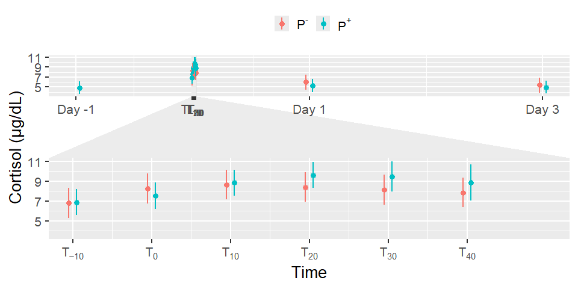
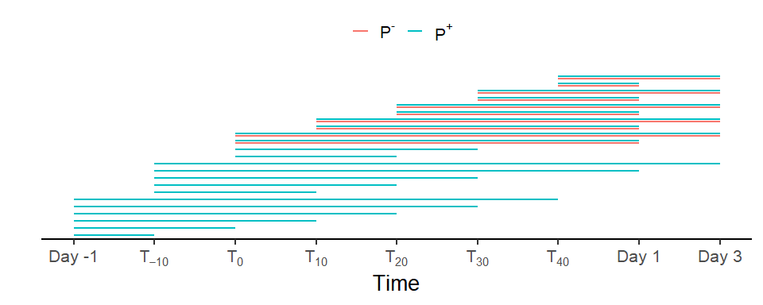
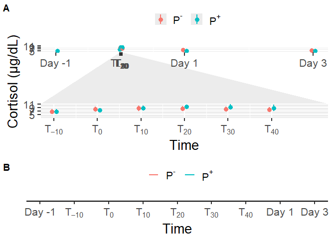

# Read data

``` r
load(file = "DATA/Data.RData") 
Data = Data %>% 
    dplyr::select(Patient,Treatment,Replicate,HousingEnvironment,Punctures,Time,Manipulation,Cortisol,cumulativepunctures) %>% 
    dplyr::mutate(Time = as.factor(Time), Treatment= as.factor(Treatment)) 
```

# Model building

``` r
Model = lmer(Cortisol ~ Treatment*Time + (1+ Replicate|Patient), data = Data)
```

    ## fixed-effect model matrix is rank deficient so dropping 1 column / coefficient

``` r
summary(Model)
```

    ## Linear mixed model fit by REML. t-tests use Satterthwaite's method [
    ## lmerModLmerTest]
    ## Formula: Cortisol ~ Treatment * Time + (1 + Replicate | Patient)
    ##    Data: Data
    ## 
    ## REML criterion at convergence: 616.4
    ## 
    ## Scaled residuals: 
    ##      Min       1Q   Median       3Q      Max 
    ## -2.72072 -0.55120 -0.02823  0.60093  2.95429 
    ## 
    ## Random effects:
    ##  Groups   Name        Variance Std.Dev. Corr       
    ##  Patient  (Intercept) 4.2531   2.0623              
    ##           Replicate2  0.4851   0.6965   -0.67      
    ##           Replicate3  1.4655   1.2106   -0.50  0.95
    ##  Residual             1.4337   1.1974              
    ## Number of obs: 185, groups:  Patient, 8
    ## 
    ## Fixed effects:
    ##                        Estimate Std. Error       df t value Pr(>|t|)    
    ## (Intercept)              5.2298     0.8722  21.7627   5.996 5.14e-06 ***
    ## TreatmentTRUE           -0.3854     0.5730  65.9919  -0.673 0.503526    
    ## Time-10                  1.5844     0.7332 147.8455   2.161 0.032320 *  
    ## Time0                    3.0344     0.7332 147.8455   4.138 5.85e-05 ***
    ## Time10                   3.4219     0.7332 147.8455   4.667 6.80e-06 ***
    ## Time20                   3.1844     0.7332 147.8455   4.343 2.60e-05 ***
    ## Time30                   2.9094     0.7332 147.8455   3.968 0.000113 ***
    ## Time40                   2.6344     0.7332 147.8455   3.593 0.000445 ***
    ## Time1440                 0.7344     0.7332 147.8455   1.002 0.318191    
    ## Time4320                 0.1219     0.4233 147.8455   0.288 0.773830    
    ## TreatmentTRUE:Time-10    0.4719     0.7332 147.8455   0.644 0.520859    
    ## TreatmentTRUE:Time0     -0.3531     0.7332 147.8455  -0.482 0.630800    
    ## TreatmentTRUE:Time10     0.5844     0.7332 147.8455   0.797 0.426736    
    ## TreatmentTRUE:Time20     1.5906     0.7332 147.8455   2.169 0.031655 *  
    ## TreatmentTRUE:Time30     1.7203     0.8159 149.2564   2.109 0.036655 *  
    ## TreatmentTRUE:Time40     1.3711     0.9800 151.5657   1.399 0.163811    
    ## TreatmentTRUE:Time1440  -0.3288     0.7377 147.9542  -0.446 0.656428    
    ## ---
    ## Signif. codes:  0 '***' 0.001 '**' 0.01 '*' 0.05 '.' 0.1 ' ' 1

    ## 
    ## Correlation matrix not shown by default, as p = 17 > 12.
    ## Use print(x, correlation=TRUE)  or
    ##     vcov(x)        if you need it

    ## fit warnings:
    ## fixed-effect model matrix is rank deficient so dropping 1 column / coefficient

``` r
model_performance(Model,verbose=T)
```

    ## # Indices of model performance
    ## 
    ## AIC     |    AICc |     BIC | R2 (cond.) | R2 (marg.) |   ICC |  RMSE | Sigma
    ## -----------------------------------------------------------------------------
    ## 664.371 | 671.871 | 741.660 |      0.829 |      0.323 | 0.748 | 1.094 | 1.197

``` r
PlotData = get_model_data(Model, type= "emm", terms= c("Time","Treatment"))  
PlotData = as.data.frame(PlotData) %>% dplyr::mutate( 
   groupString = as.character(group),
    x = case_when(
    x == -1440 & groupString == "FALSE" ~ x - 40 ,
    x == -1440 & groupString == "TRUE" ~ x + 40,
    x == 1440 & groupString == "FALSE" ~ x - 40 ,
    x == 1440 & groupString == "TRUE" ~ x + 40,
    x == 4320 & groupString == "FALSE" ~ x - 40 ,
    x == 4320 & groupString == "TRUE" ~ x + 40,
    TRUE ~ x)
)

CortisolPlot = ggplot(data = PlotData,aes(x= x, y=predicted, color = group))+
  geom_point(position = position_dodge(2),size = 3) +
  facet_zoom(xlim = c(-10, 50)) +
  geom_linerange(size = 1, aes(ymin = conf.low, ymax = conf.high,colour = group),position = position_dodge(2)) +
  xlab("Time") + 
  ylab("Cortisol (µg/dL)") + 
  scale_x_continuous(labels=c("Day -1",expression(T[scriptstyle(-10)]),expression(T[scriptstyle(0)]),expression(T[scriptstyle(10)]),expression(T[scriptstyle(20)]),expression(T[scriptstyle(30)]),expression(T[scriptstyle(40)]),"Day 1","Day 3"), breaks = c(-1440,-10,0,10,20,30,40,1440,4320)) + theme(legend.position = "Top",legend.title = element_text("Puncture"))
```

    ## Warning: Using `size` aesthetic for lines was deprecated in ggplot2 3.4.0.
    ## ℹ Please use `linewidth` instead.
    ## This warning is displayed once every 8 hours.
    ## Call `lifecycle::last_lifecycle_warnings()` to see where this warning was
    ## generated.

``` r
CortisolPlot = CortisolPlot+ theme_grey(base_size = 20) + 
  labs(color = "")+
  scale_color_discrete(labels=c(expression("P"^"-"), expression("P"^"+")))+
  theme(legend.position = "top") 
CortisolPlot
```

    ## Warning: Removed 2 rows containing missing values or values outside the scale range
    ## (`geom_point()`).

    ## Warning: Removed 1 row containing missing values or values outside the scale range
    ## (`geom_segment()`).
    ## Removed 1 row containing missing values or values outside the scale range
    ## (`geom_segment()`).



``` r
ggsave(plot = CortisolPlot,
       filename = "CortisolPlot.png",
       path= "FIGURES/",
       width = 10,
       height = 7
       )
```

    ## Warning: Removed 2 rows containing missing values or values outside the scale range
    ## (`geom_point()`).

    ## Warning: Removed 1 row containing missing values or values outside the scale range
    ## (`geom_segment()`).
    ## Removed 1 row containing missing values or values outside the scale range
    ## (`geom_segment()`).

``` r
emmeans(Model, pairwise ~ Time|Treatment)
```

    ## $emmeans
    ## Treatment = FALSE:
    ##  Time  emmean    SE   df lower.CL upper.CL
    ##  -1440 nonEst    NA   NA       NA       NA
    ##  -10     6.81 0.839 13.0     5.00     8.63
    ##  0       8.26 0.839 13.0     6.45    10.08
    ##  10      8.65 0.839 13.0     6.84    10.46
    ##  20      8.41 0.839 13.0     6.60    10.23
    ##  30      8.14 0.839 13.0     6.33     9.95
    ##  40      7.86 0.839 13.0     6.05     9.68
    ##  1440    5.96 0.839 13.0     4.15     7.78
    ##  4320    5.35 0.839 13.0     3.54     7.16
    ## 
    ## Treatment = TRUE:
    ##  Time  emmean    SE   df lower.CL upper.CL
    ##  -1440   4.84 0.753 10.1     3.17     6.52
    ##  -10     6.90 0.753 10.1     5.23     8.58
    ##  0       7.53 0.753 10.1     5.85     9.20
    ##  10      8.85 0.753 10.1     7.18    10.53
    ##  20      9.62 0.753 10.1     7.94    11.29
    ##  30      9.47 0.840 16.5     7.70    11.25
    ##  40      8.85 1.000 32.9     6.82    10.88
    ##  1440    5.25 0.756 10.3     3.57     6.93
    ##  4320    4.97 0.753 10.1     3.29     6.64
    ## 
    ## Degrees-of-freedom method: kenward-roger 
    ## Confidence level used: 0.95 
    ## 
    ## $contrasts
    ## Treatment = FALSE:
    ##  contrast                 estimate    SE  df t.ratio p.value
    ##  (Time-1440) - (Time-10)    nonEst    NA  NA      NA      NA
    ##  (Time-1440) - Time0        nonEst    NA  NA      NA      NA
    ##  (Time-1440) - Time10       nonEst    NA  NA      NA      NA
    ##  (Time-1440) - Time20       nonEst    NA  NA      NA      NA
    ##  (Time-1440) - Time30       nonEst    NA  NA      NA      NA
    ##  (Time-1440) - Time40       nonEst    NA  NA      NA      NA
    ##  (Time-1440) - Time1440     nonEst    NA  NA      NA      NA
    ##  (Time-1440) - Time4320     nonEst    NA  NA      NA      NA
    ##  (Time-10) - Time0       -1.450000 0.599 147  -2.422  0.2387
    ##  (Time-10) - Time10      -1.837500 0.599 147  -3.069  0.0508
    ##  (Time-10) - Time20      -1.600000 0.599 147  -2.673  0.1395
    ##  (Time-10) - Time30      -1.325000 0.599 147  -2.213  0.3500
    ##  (Time-10) - Time40      -1.050000 0.599 147  -1.754  0.6520
    ##  (Time-10) - Time1440     0.850000 0.599 147   1.420  0.8468
    ##  (Time-10) - Time4320     1.462500 0.599 147   2.443  0.2290
    ##  Time0 - Time10          -0.387500 0.599 147  -0.647  0.9981
    ##  Time0 - Time20          -0.150000 0.599 147  -0.251  1.0000
    ##  Time0 - Time30           0.125000 0.599 147   0.209  1.0000
    ##  Time0 - Time40           0.400000 0.599 147   0.668  0.9977
    ##  Time0 - Time1440         2.300000 0.599 147   3.842  0.0044
    ##  Time0 - Time4320         2.912500 0.599 147   4.865  0.0001
    ##  Time10 - Time20          0.237500 0.599 147   0.397  0.9999
    ##  Time10 - Time30          0.512500 0.599 147   0.856  0.9893
    ##  Time10 - Time40          0.787500 0.599 147   1.315  0.8917
    ##  Time10 - Time1440        2.687500 0.599 147   4.489  0.0004
    ##  Time10 - Time4320        3.300000 0.599 147   5.512  <.0001
    ##  Time20 - Time30          0.275000 0.599 147   0.459  0.9998
    ##  Time20 - Time40          0.550000 0.599 147   0.919  0.9838
    ##  Time20 - Time1440        2.450000 0.599 147   4.092  0.0018
    ##  Time20 - Time4320        3.062500 0.599 147   5.115  <.0001
    ##  Time30 - Time40          0.275000 0.599 147   0.459  0.9998
    ##  Time30 - Time1440        2.175000 0.599 147   3.633  0.0090
    ##  Time30 - Time4320        2.787500 0.599 147   4.656  0.0002
    ##  Time40 - Time1440        1.900000 0.599 147   3.174  0.0378
    ##  Time40 - Time4320        2.512500 0.599 147   4.197  0.0012
    ##  Time1440 - Time4320      0.612500 0.599 147   1.023  0.9703
    ## 
    ## Treatment = TRUE:
    ##  contrast                 estimate    SE  df t.ratio p.value
    ##  (Time-1440) - (Time-10) -2.056250 0.423 147  -4.857  0.0001
    ##  (Time-1440) - Time0     -2.681250 0.423 147  -6.334  <.0001
    ##  (Time-1440) - Time10    -4.006250 0.423 147  -9.464  <.0001
    ##  (Time-1440) - Time20    -4.775000 0.423 147 -11.280  <.0001
    ##  (Time-1440) - Time30    -4.629667 0.559 150  -8.289  <.0001
    ##  (Time-1440) - Time40    -4.005485 0.790 153  -5.071  <.0001
    ##  (Time-1440) - Time1440  -0.405532 0.431 147  -0.940  0.9902
    ##  (Time-1440) - Time4320  -0.121875 0.423 147  -0.288  1.0000
    ##  (Time-10) - Time0       -0.625000 0.423 147  -1.476  0.8647
    ##  (Time-10) - Time10      -1.950000 0.423 147  -4.606  0.0003
    ##  (Time-10) - Time20      -2.718750 0.423 147  -6.422  <.0001
    ##  (Time-10) - Time30      -2.573417 0.559 150  -4.607  0.0003
    ##  (Time-10) - Time40      -1.949235 0.790 153  -2.468  0.2563
    ##  (Time-10) - Time1440     1.650718 0.431 147   3.827  0.0058
    ##  (Time-10) - Time4320     1.934375 0.423 147   4.569  0.0003
    ##  Time0 - Time10          -1.325000 0.423 147  -3.130  0.0527
    ##  Time0 - Time20          -2.093750 0.423 147  -4.946  0.0001
    ##  Time0 - Time30          -1.948417 0.559 150  -3.488  0.0180
    ##  Time0 - Time40          -1.324235 0.790 153  -1.676  0.7599
    ##  Time0 - Time1440         2.275718 0.431 147   5.276  <.0001
    ##  Time0 - Time4320         2.559375 0.423 147   6.046  <.0001
    ##  Time10 - Time20         -0.768750 0.423 147  -1.816  0.6716
    ##  Time10 - Time30         -0.623417 0.559 150  -1.116  0.9710
    ##  Time10 - Time40          0.000765 0.790 153   0.001  1.0000
    ##  Time10 - Time1440        3.600718 0.431 147   8.348  <.0001
    ##  Time10 - Time4320        3.884375 0.423 147   9.176  <.0001
    ##  Time20 - Time30          0.145333 0.559 150   0.260  1.0000
    ##  Time20 - Time40          0.769515 0.790 153   0.974  0.9877
    ##  Time20 - Time1440        4.369468 0.431 147  10.130  <.0001
    ##  Time20 - Time4320        4.653125 0.423 147  10.992  <.0001
    ##  Time30 - Time40          0.624182 0.849 151   0.735  0.9982
    ##  Time30 - Time1440        4.224135 0.567 151   7.451  <.0001
    ##  Time30 - Time4320        4.507792 0.559 150   8.071  <.0001
    ##  Time40 - Time1440        3.599953 0.794 153   4.536  0.0004
    ##  Time40 - Time4320        3.883610 0.790 153   4.916  0.0001
    ##  Time1440 - Time4320      0.283657 0.431 147   0.658  0.9992
    ## 
    ## Degrees-of-freedom method: kenward-roger 
    ## P value adjustment: tukey method for varying family sizes

``` r
emmeans(Model, pairwise ~ Treatment|Time)
```

    ## $emmeans
    ## Time = -1440:
    ##  Treatment emmean    SE   df lower.CL upper.CL
    ##  FALSE     nonEst    NA   NA       NA       NA
    ##  TRUE        4.84 0.753 10.1     3.17     6.52
    ## 
    ## Time = -10:
    ##  Treatment emmean    SE   df lower.CL upper.CL
    ##  FALSE       6.81 0.839 13.0     5.00     8.63
    ##  TRUE        6.90 0.753 10.1     5.23     8.58
    ## 
    ## Time = 0:
    ##  Treatment emmean    SE   df lower.CL upper.CL
    ##  FALSE       8.26 0.839 13.0     6.45    10.08
    ##  TRUE        7.53 0.753 10.1     5.85     9.20
    ## 
    ## Time = 10:
    ##  Treatment emmean    SE   df lower.CL upper.CL
    ##  FALSE       8.65 0.839 13.0     6.84    10.46
    ##  TRUE        8.85 0.753 10.1     7.18    10.53
    ## 
    ## Time = 20:
    ##  Treatment emmean    SE   df lower.CL upper.CL
    ##  FALSE       8.41 0.839 13.0     6.60    10.23
    ##  TRUE        9.62 0.753 10.1     7.94    11.29
    ## 
    ## Time = 30:
    ##  Treatment emmean    SE   df lower.CL upper.CL
    ##  FALSE       8.14 0.839 13.0     6.33     9.95
    ##  TRUE        9.47 0.840 16.5     7.70    11.25
    ## 
    ## Time = 40:
    ##  Treatment emmean    SE   df lower.CL upper.CL
    ##  FALSE       7.86 0.839 13.0     6.05     9.68
    ##  TRUE        8.85 1.000 32.9     6.82    10.88
    ## 
    ## Time = 1440:
    ##  Treatment emmean    SE   df lower.CL upper.CL
    ##  FALSE       5.96 0.839 13.0     4.15     7.78
    ##  TRUE        5.25 0.756 10.3     3.57     6.93
    ## 
    ## Time = 4320:
    ##  Treatment emmean    SE   df lower.CL upper.CL
    ##  FALSE       5.35 0.839 13.0     3.54     7.16
    ##  TRUE        4.97 0.753 10.1     3.29     6.64
    ## 
    ## Degrees-of-freedom method: kenward-roger 
    ## Confidence level used: 0.95 
    ## 
    ## $contrasts
    ## Time = -1440:
    ##  contrast     estimate    SE    df t.ratio p.value
    ##  FALSE - TRUE   nonEst    NA    NA      NA      NA
    ## 
    ## Time = -10:
    ##  contrast     estimate    SE    df t.ratio p.value
    ##  FALSE - TRUE  -0.0864 0.601  63.8  -0.144  0.8861
    ## 
    ## Time = 0:
    ##  contrast     estimate    SE    df t.ratio p.value
    ##  FALSE - TRUE   0.7386 0.601  63.8   1.229  0.2236
    ## 
    ## Time = 10:
    ##  contrast     estimate    SE    df t.ratio p.value
    ##  FALSE - TRUE  -0.1989 0.601  63.8  -0.331  0.7417
    ## 
    ## Time = 20:
    ##  contrast     estimate    SE    df t.ratio p.value
    ##  FALSE - TRUE  -1.2052 0.601  63.8  -2.006  0.0491
    ## 
    ## Time = 30:
    ##  contrast     estimate    SE    df t.ratio p.value
    ##  FALSE - TRUE  -1.3349 0.705  91.2  -1.892  0.0616
    ## 
    ## Time = 40:
    ##  contrast     estimate    SE    df t.ratio p.value
    ##  FALSE - TRUE  -0.9857 0.892 122.1  -1.105  0.2715
    ## 
    ## Time = 1440:
    ##  contrast     estimate    SE    df t.ratio p.value
    ##  FALSE - TRUE   0.7143 0.605  65.0   1.181  0.2419
    ## 
    ## Time = 4320:
    ##  contrast     estimate    SE    df t.ratio p.value
    ##  FALSE - TRUE   0.3854 0.601  63.8   0.641  0.5236
    ## 
    ## Degrees-of-freedom method: kenward-roger

``` r
dfplot = emmeans(Model,pairwise ~Time|Treatment)
```

``` r
dfplot = dfplot$contrasts %>% as.data.frame() %>% 
  dplyr::filter(p.value <= 0.05) %>% 
  dplyr::mutate(contrast1 = contrast) %>%
  tidyr::separate(contrast1,c("first","second"), sep = " - ") %>%
  dplyr::mutate(firstnumeric = case_when(
    first =="(Time-1440)" ~ 1,
    first =="(Time-10)" ~ 2,
    first =="Time0" ~ 3,
    first =="Time10" ~ 4,
    first =="Time20" ~ 5,
    first =="Time30" ~ 6,
    first =="Time40" ~ 7,
    first =="Time1440" ~ 8,
    first =="Time4320" ~ 9,
    TRUE ~ 0
  ),
  secondnumeric = case_when(
    second =="(Time-1440)" ~ 1,
    second =="(Time-10)" ~ 2,
    second =="Time0" ~ 3,
    second =="Time10" ~ 4,
    second =="Time20" ~ 5,
    second =="Time30" ~ 6,
    second =="Time40" ~ 7,
    second =="Time1440" ~ 8,
    second =="Time4320" ~ 9,
    TRUE ~ 0
  ),
  )
```

``` r
Time = ggplot(data = dfplot, aes(y = contrast,colour= Treatment)) +
  scale_x_continuous(breaks = c(1,2,3,4,5,6,7,8,9),labels=c("(Time-1440)"="Day -1","(Time-10)"=expression(T[scriptstyle(-10)]),"Time0"=expression(T[scriptstyle(0)]),"Time10"=expression(T[scriptstyle(10)]),"Time20"=expression(T[scriptstyle(20)]),"Time30"=expression(T[scriptstyle(30)]),"Time40"=expression(T[scriptstyle(40)]),"Time1440"="Day 1","Time4320"="Day 3")) + 
  geom_errorbarh(aes(xmax = firstnumeric, xmin = secondnumeric,height = 0), 
                 position = position_dodge(.75),
                 size = 1) + 
  labs(y = "",x= "Time") +
  theme_classic(base_size = 20) + 
  theme(
    axis.line.y = element_blank(),
    axis.text.y = element_blank(),
    axis.ticks.y= element_blank(), 
    text = element_text(colour = "black")
  ) +  
  labs(color = "")+
  scale_color_discrete(labels=c(expression("P"^"-"), expression("P"^"+")))+
  theme(legend.position = "top")
Time
```



``` r
Together  = ggarrange(CortisolPlot, Time,ncol=1,nrow = 2,labels = "AUTO",heights = c(2,1))
```

    ## Warning: Removed 2 rows containing missing values or values outside the scale range
    ## (`geom_point()`).

    ## Warning: Removed 1 row containing missing values or values outside the scale range
    ## (`geom_segment()`).
    ## Removed 1 row containing missing values or values outside the scale range
    ## (`geom_segment()`).

``` r
Together
```



``` r
ggsave(plot = Together,
       filename = "CortisolPlotTogether.png",
       path= "FIGURES/",
       width = 10,
       height = 12
       )
```
