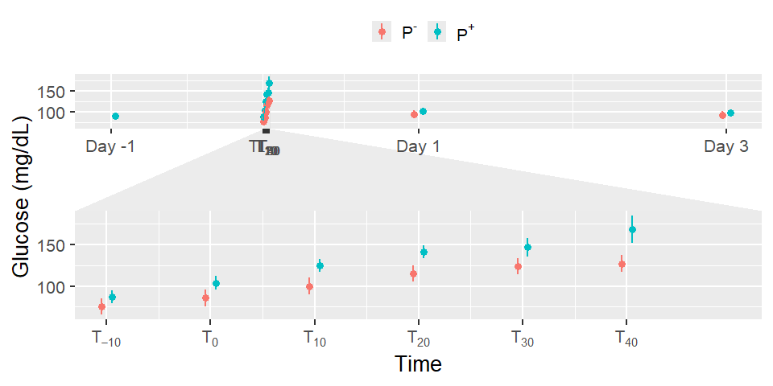

# Read data

``` r
load(file = "DATA/Data.RData") 
Data = Data %>% 
      dplyr::select(Patient,Treatment,Replicate,HousingEnvironment,Punctures,Time,Manipulation,Glucose,cumulativepunctures) %>%  
    dplyr::mutate(Time = as.factor(Time), Treatment= as.factor(Treatment)) 
```

# Model building

``` r
Model = lmer(Glucose ~ Treatment*Time + (1+ Replicate|Patient), data = Data)
```

    ## fixed-effect model matrix is rank deficient so dropping 1 column / coefficient

    ## boundary (singular) fit: see help('isSingular')

``` r
summary(Model)
```

    ## Linear mixed model fit by REML. t-tests use Satterthwaite's method [
    ## lmerModLmerTest]
    ## Formula: Glucose ~ Treatment * Time + (1 + Replicate | Patient)
    ##    Data: Data
    ## 
    ## REML criterion at convergence: 1418.6
    ## 
    ## Scaled residuals: 
    ##      Min       1Q   Median       3Q      Max 
    ## -1.97337 -0.65332 -0.02387  0.55809  2.95787 
    ## 
    ## Random effects:
    ##  Groups   Name        Variance Std.Dev. Corr       
    ##  Patient  (Intercept) 134.49   11.597              
    ##           Replicate2   61.51    7.843   -0.92      
    ##           Replicate3   86.70    9.311   -0.86  0.60
    ##  Residual             180.84   13.448              
    ## Number of obs: 186, groups:  Patient, 8
    ## 
    ## Fixed effects:
    ##                        Estimate Std. Error       df t value Pr(>|t|)    
    ## (Intercept)             84.8400     6.9102 145.7660  12.277  < 2e-16 ***
    ## TreatmentTRUE            5.3851     6.4125  68.6136   0.840 0.403948    
    ## Time-10                 -9.5625     8.2351 154.4654  -1.161 0.247354    
    ## Time0                    0.6875     8.2351 154.4654   0.083 0.933574    
    ## Time10                  15.0625     8.2351 154.4654   1.829 0.069317 .  
    ## Time20                  30.3125     8.2351 154.4654   3.681 0.000321 ***
    ## Time30                  38.5625     8.2351 154.4654   4.683 6.16e-06 ***
    ## Time40                  42.1875     8.2351 154.4654   5.123 8.86e-07 ***
    ## Time1440                 7.8125     8.2351 154.4654   0.949 0.344261    
    ## Time4320                 6.4375     4.7545 154.4654   1.354 0.177721    
    ## TreatmentTRUE:Time-10    6.1875     8.2351 154.4654   0.751 0.453578    
    ## TreatmentTRUE:Time0     12.9375     8.2351 154.4654   1.571 0.118222    
    ## TreatmentTRUE:Time10    19.5000     8.2351 154.4654   2.368 0.019126 *  
    ## TreatmentTRUE:Time20    20.5625     8.2351 154.4654   2.497 0.013576 *  
    ## TreatmentTRUE:Time30    17.7031     9.1549 155.6114   1.934 0.054962 .  
    ## TreatmentTRUE:Time40    35.7080    10.9867 156.5424   3.250 0.001412 ** 
    ## TreatmentTRUE:Time1440   2.3750     8.2351 154.4654   0.288 0.773426    
    ## ---
    ## Signif. codes:  0 '***' 0.001 '**' 0.01 '*' 0.05 '.' 0.1 ' ' 1

    ## 
    ## Correlation matrix not shown by default, as p = 17 > 12.
    ## Use print(x, correlation=TRUE)  or
    ##     vcov(x)        if you need it

    ## fit warnings:
    ## fixed-effect model matrix is rank deficient so dropping 1 column / coefficient
    ## optimizer (nloptwrap) convergence code: 0 (OK)
    ## boundary (singular) fit: see help('isSingular')

``` r
model_performance(Model,verbose=T)
```

    ## # Indices of model performance
    ## 
    ## AIC      |     AICc |      BIC | R2 (cond.) | R2 (marg.) |   ICC |   RMSE |  Sigma
    ## ----------------------------------------------------------------------------------
    ## 1466.568 | 1474.022 | 1543.986 |      0.760 |      0.581 | 0.426 | 12.409 | 13.448

``` r
check_residuals(Model)
```

    ## Warning: Non-uniformity of simulated residuals detected (p = 0.030).

``` r
check_homogeneity(Model)
```

    ## OK: There is not clear evidence for different variances across groups (Bartlett Test, p = 0.066).

``` r
PlotData = get_model_data(Model, type= "emm", terms= c("Time","Treatment")) 
PlotData = as.data.frame(PlotData) %>% dplyr::mutate( 
   groupString = as.character(group),
    x = case_when(
    x == -1440 & groupString == "FALSE" ~ x - 40 ,
    x == -1440 & groupString == "TRUE" ~ x + 40,
    x == 1440 & groupString == "FALSE" ~ x - 40 ,
    x == 1440 & groupString == "TRUE" ~ x + 40,
    x == 4320 & groupString == "FALSE" ~ x - 40 ,
    x == 4320 & groupString == "TRUE" ~ x + 40,
    TRUE ~ x)
)

GlucosePlot = ggplot(data = PlotData,aes(x= x, y=predicted, color = group))+ 
  geom_point(position = position_dodge(2),size = 3) +
  facet_zoom(xlim = c(-10, 50)) +
  geom_linerange(size = 1, aes(ymin = conf.low, ymax = conf.high,colour = group),position = position_dodge(2)) + 
  xlab("Time") + 
  ylab("Glucose (mg/dL)") + 
  scale_x_continuous(labels=c("Day -1",expression(T[scriptstyle(-10)]),expression(T[scriptstyle(0)]),expression(T[scriptstyle(10)]),expression(T[scriptstyle(20)]),expression(T[scriptstyle(30)]),expression(T[scriptstyle(40)]),"Day 1","Day 3"), breaks = c(-1440,-10,0,10,20,30,40,1440,4320)) + theme(legend.position = "Top",legend.title = element_text("Puncture"))
```

    ## Warning: Using `size` aesthetic for lines was deprecated in ggplot2 3.4.0.
    ## ℹ Please use `linewidth` instead.
    ## This warning is displayed once every 8 hours.
    ## Call `lifecycle::last_lifecycle_warnings()` to see where this warning was
    ## generated.

``` r
GlucosePlot = GlucosePlot+ theme_grey(base_size = 20) + 
  labs(color = "")+
  scale_color_discrete(labels=c(expression("P"^"-"), expression("P"^"+")))+
  theme(legend.position = "top") 
GlucosePlot
```

    ## Warning: Removed 2 rows containing missing values or values outside the scale range
    ## (`geom_point()`).

    ## Warning: Removed 1 row containing missing values or values outside the scale range
    ## (`geom_segment()`).
    ## Removed 1 row containing missing values or values outside the scale range
    ## (`geom_segment()`).



``` r
ggsave(plot = GlucosePlot,
       filename = "GlucosePlot.png",
       path= "FIGURES/",
       width = 10,
       height = 7)
```

    ## Warning: Removed 2 rows containing missing values or values outside the scale range
    ## (`geom_point()`).

    ## Warning: Removed 1 row containing missing values or values outside the scale range
    ## (`geom_segment()`).
    ## Removed 1 row containing missing values or values outside the scale range
    ## (`geom_segment()`).

``` r
emmeans(Model, pairwise ~ Time|Treatment)
```

    ## $emmeans
    ## Treatment = FALSE:
    ##  Time  emmean   SE    df lower.CL upper.CL
    ##  -1440 nonEst   NA    NA       NA       NA
    ##  -10     75.3 5.17  93.3     65.0     85.5
    ##  0       85.5 5.17  93.3     75.3     95.8
    ##  10      99.9 5.17  93.3     89.6    110.2
    ##  20     115.2 5.17  93.3    104.9    125.4
    ##  30     123.4 5.17  93.3    113.1    133.7
    ##  40     127.0 5.17  93.3    116.8    137.3
    ##  1440    92.7 5.17  93.3     82.4    102.9
    ##  4320    91.3 5.17  93.3     81.0    101.5
    ## 
    ## Treatment = TRUE:
    ##  Time  emmean   SE    df lower.CL upper.CL
    ##  -1440   90.2 4.40  34.8     81.3     99.2
    ##  -10     86.9 4.40  34.8     77.9     95.8
    ##  0      103.9 4.40  34.8     94.9    112.8
    ##  10     124.8 4.40  34.8    115.9    133.7
    ##  20     141.1 4.40  34.8    132.2    150.0
    ##  30     146.5 6.03  82.1    134.5    158.5
    ##  40     168.1 8.64 126.1    151.0    185.2
    ##  1440   100.4 4.40  34.8     91.5    109.3
    ##  4320    96.7 4.40  34.8     87.7    105.6
    ## 
    ## Degrees-of-freedom method: kenward-roger 
    ## Confidence level used: 0.95 
    ## 
    ## $contrasts
    ## Treatment = FALSE:
    ##  contrast                estimate   SE  df t.ratio p.value
    ##  (Time-1440) - (Time-10)   nonEst   NA  NA      NA      NA
    ##  (Time-1440) - Time0       nonEst   NA  NA      NA      NA
    ##  (Time-1440) - Time10      nonEst   NA  NA      NA      NA
    ##  (Time-1440) - Time20      nonEst   NA  NA      NA      NA
    ##  (Time-1440) - Time30      nonEst   NA  NA      NA      NA
    ##  (Time-1440) - Time40      nonEst   NA  NA      NA      NA
    ##  (Time-1440) - Time1440    nonEst   NA  NA      NA      NA
    ##  (Time-1440) - Time4320    nonEst   NA  NA      NA      NA
    ##  (Time-10) - Time0         -10.25 6.72 148  -1.524  0.7931
    ##  (Time-10) - Time10        -24.62 6.72 148  -3.662  0.0081
    ##  (Time-10) - Time20        -39.88 6.72 148  -5.930  <.0001
    ##  (Time-10) - Time30        -48.12 6.72 148  -7.157  <.0001
    ##  (Time-10) - Time40        -51.75 6.72 148  -7.696  <.0001
    ##  (Time-10) - Time1440      -17.38 6.72 148  -2.584  0.1701
    ##  (Time-10) - Time4320      -16.00 6.72 148  -2.380  0.2592
    ##  Time0 - Time10            -14.38 6.72 148  -2.138  0.3958
    ##  Time0 - Time20            -29.62 6.72 148  -4.406  0.0005
    ##  Time0 - Time30            -37.88 6.72 148  -5.633  <.0001
    ##  Time0 - Time40            -41.50 6.72 148  -6.172  <.0001
    ##  Time0 - Time1440           -7.12 6.72 148  -1.060  0.9640
    ##  Time0 - Time4320           -5.75 6.72 148  -0.855  0.9894
    ##  Time10 - Time20           -15.25 6.72 148  -2.268  0.3184
    ##  Time10 - Time30           -23.50 6.72 148  -3.495  0.0141
    ##  Time10 - Time40           -27.12 6.72 148  -4.034  0.0022
    ##  Time10 - Time1440           7.25 6.72 148   1.078  0.9604
    ##  Time10 - Time4320           8.62 6.72 148   1.283  0.9039
    ##  Time20 - Time30            -8.25 6.72 148  -1.227  0.9227
    ##  Time20 - Time40           -11.88 6.72 148  -1.766  0.6438
    ##  Time20 - Time1440          22.50 6.72 148   3.346  0.0226
    ##  Time20 - Time4320          23.88 6.72 148   3.551  0.0118
    ##  Time30 - Time40            -3.62 6.72 148  -0.539  0.9994
    ##  Time30 - Time1440          30.75 6.72 148   4.573  0.0003
    ##  Time30 - Time4320          32.12 6.72 148   4.778  0.0001
    ##  Time40 - Time1440          34.38 6.72 148   5.112  <.0001
    ##  Time40 - Time4320          35.75 6.72 148   5.317  <.0001
    ##  Time1440 - Time4320         1.38 6.72 148   0.204  1.0000
    ## 
    ## Treatment = TRUE:
    ##  contrast                estimate   SE  df t.ratio p.value
    ##  (Time-1440) - (Time-10)     3.38 4.75 148   0.710  0.9986
    ##  (Time-1440) - Time0       -13.62 4.75 148  -2.866  0.1058
    ##  (Time-1440) - Time10      -34.56 4.75 148  -7.269  <.0001
    ##  (Time-1440) - Time20      -50.88 4.75 148 -10.700  <.0001
    ##  (Time-1440) - Time30      -56.27 6.27 152  -8.969  <.0001
    ##  (Time-1440) - Time40      -77.90 8.88 155  -8.773  <.0001
    ##  (Time-1440) - Time1440    -10.19 4.75 148  -2.143  0.4487
    ##  (Time-1440) - Time4320     -6.44 4.75 148  -1.354  0.9128
    ##  (Time-10) - Time0         -17.00 4.75 148  -3.576  0.0136
    ##  (Time-10) - Time10        -37.94 4.75 148  -7.979  <.0001
    ##  (Time-10) - Time20        -54.25 4.75 148 -11.410  <.0001
    ##  (Time-10) - Time30        -59.64 6.27 152  -9.507  <.0001
    ##  (Time-10) - Time40        -81.27 8.88 155  -9.153  <.0001
    ##  (Time-10) - Time1440      -13.56 4.75 148  -2.853  0.1093
    ##  (Time-10) - Time4320       -9.81 4.75 148  -2.064  0.5020
    ##  Time0 - Time10            -20.94 4.75 148  -4.404  0.0007
    ##  Time0 - Time20            -37.25 4.75 148  -7.835  <.0001
    ##  Time0 - Time30            -42.64 6.27 152  -6.797  <.0001
    ##  Time0 - Time40            -64.27 8.88 155  -7.239  <.0001
    ##  Time0 - Time1440            3.44 4.75 148   0.723  0.9984
    ##  Time0 - Time4320            7.19 4.75 148   1.512  0.8485
    ##  Time10 - Time20           -16.31 4.75 148  -3.431  0.0216
    ##  Time10 - Time30           -21.70 6.27 152  -3.460  0.0196
    ##  Time10 - Time40           -43.33 8.88 155  -4.880  0.0001
    ##  Time10 - Time1440          24.38 4.75 148   5.127  <.0001
    ##  Time10 - Time4320          28.12 4.75 148   5.915  <.0001
    ##  Time20 - Time30            -5.39 6.27 152  -0.859  0.9947
    ##  Time20 - Time40           -27.02 8.88 155  -3.043  0.0664
    ##  Time20 - Time1440          40.69 4.75 148   8.558  <.0001
    ##  Time20 - Time4320          44.44 4.75 148   9.346  <.0001
    ##  Time30 - Time40           -21.63 9.54 153  -2.268  0.3681
    ##  Time30 - Time1440          46.08 6.27 152   7.345  <.0001
    ##  Time30 - Time4320          49.83 6.27 152   7.943  <.0001
    ##  Time40 - Time1440          67.71 8.88 155   7.626  <.0001
    ##  Time40 - Time4320          71.46 8.88 155   8.048  <.0001
    ##  Time1440 - Time4320         3.75 4.75 148   0.789  0.9970
    ## 
    ## Degrees-of-freedom method: kenward-roger 
    ## P value adjustment: tukey method for varying family sizes

``` r
dfplot = emmeans(Model,pairwise ~Time|Treatment)
```

``` r
dfplot = dfplot$contrasts %>% as.data.frame() %>% 
  dplyr::filter(p.value <= 0.05) %>% 
  dplyr::mutate(contrast1 = contrast) %>%
  tidyr::separate(contrast1,c("first","second"), sep = " - ") %>%
  dplyr::mutate(firstnumeric = case_when(
    first =="(Time-1440)" ~ 1,
    first =="(Time-10)" ~ 2,
    first =="Time0" ~ 3,
    first =="Time10" ~ 4,
    first =="Time20" ~ 5,
    first =="Time30" ~ 6,
    first =="Time40" ~ 7,
    first =="Time1440" ~ 8,
    first =="Time4320" ~ 9,
    TRUE ~ 0
  ),
  secondnumeric = case_when(
    second =="(Time-1440)" ~ 1,
    second =="(Time-10)" ~ 2,
    second =="Time0" ~ 3,
    second =="Time10" ~ 4,
    second =="Time20" ~ 5,
    second =="Time30" ~ 6,
    second =="Time40" ~ 7,
    second =="Time1440" ~ 8,
    second =="Time4320" ~ 9,
    TRUE ~ 0
  ),
  )
```

``` r
Time = ggplot(data = dfplot, aes(y = contrast,colour= Treatment)) +
  scale_x_continuous(breaks = c(1,2,3,4,5,6,7,8,9),labels=c("(Time-1440)"="Day -1","(Time-10)"=expression(T[scriptstyle(-10)]),"Time0"=expression(T[scriptstyle(0)]),"Time10"=expression(T[scriptstyle(10)]),"Time20"=expression(T[scriptstyle(20)]),"Time30"=expression(T[scriptstyle(30)]),"Time40"=expression(T[scriptstyle(40)]),"Time1440"="Day 1","Time4320"="Day 3")) + 
  geom_errorbarh(aes(xmax = firstnumeric, xmin = secondnumeric,height = 0), 
                 position = position_dodge(.75),
                 size = 1) + 
  labs(y = "",x= "Time") +
  theme_classic(base_size = 20) + 
  theme(
    axis.line.y = element_blank(),
    axis.text.y = element_blank(),
    axis.ticks.y= element_blank(), 
    text = element_text(colour = "black")
  ) +  
  labs(color = "")+
  scale_color_discrete(labels=c(expression("P"^"-"), expression("P"^"+")))+
  theme(legend.position = "top")
Time
```


``` r
Together  = ggarrange(GlucosePlot, Time,ncol=1,nrow = 2,labels = "AUTO",heights = c(2,1))
```

    ## Warning: Removed 2 rows containing missing values or values outside the scale range
    ## (`geom_point()`).

    ## Warning: Removed 1 row containing missing values or values outside the scale range
    ## (`geom_segment()`).
    ## Removed 1 row containing missing values or values outside the scale range
    ## (`geom_segment()`).

``` r
Together
```


``` r
ggsave(plot = Together,
       filename = "GlucosePlotTogether.png",
       path= "FIGURES/",
       width = 10,
       height = 12
       )
```
