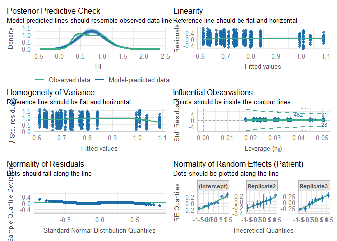

# Read data

``` r
load(file = "DATA/Cardiovascular.RData") 
cardiovascular = cardiovascular %>% 
    dplyr::select(Patient,Replicate,Time,Sedation,IntravaginalDevice,RectalManipulation,Puncturing,Needle,HF) %>% 
    dplyr::mutate(Time = as.factor(Time), 
                  Needle = as.factor(Needle),
                  HF = sqrt(HF)) %>%
    filter(IntravaginalDevice == TRUE)
```

# Model building

``` r
Model = lmer(HF ~ Needle + (1 + Replicate|Patient), data = cardiovascular)
```

``` r
summary(Model)
```

    ## Linear mixed model fit by REML. t-tests use Satterthwaite's method [
    ## lmerModLmerTest]
    ## Formula: HF ~ Needle + (1 + Replicate | Patient)
    ##    Data: cardiovascular
    ## 
    ## REML criterion at convergence: 241.4
    ## 
    ## Scaled residuals: 
    ##      Min       1Q   Median       3Q      Max 
    ## -2.33416 -0.78315 -0.04334  0.74776  2.47212 
    ## 
    ## Random effects:
    ##  Groups   Name        Variance Std.Dev. Corr       
    ##  Patient  (Intercept) 0.02254  0.1501              
    ##           Replicate2  0.02353  0.1534   -0.41      
    ##           Replicate3  0.04588  0.2142   -0.82  0.19
    ##  Residual             0.07533  0.2745              
    ## Number of obs: 736, groups:  Patient, 8
    ## 
    ## Fixed effects:
    ##             Estimate Std. Error      df t value Pr(>|t|)    
    ## (Intercept)  0.74181    0.04670 6.92149  15.883 1.06e-06 ***
    ## NeedleTRUE   0.04874    0.07752 7.00951   0.629     0.55    
    ## ---
    ## Signif. codes:  0 '***' 0.001 '**' 0.01 '*' 0.05 '.' 0.1 ' ' 1
    ## 
    ## Correlation of Fixed Effects:
    ##            (Intr)
    ## NeedleTRUE -0.774

``` r
check_model(Model)
```


