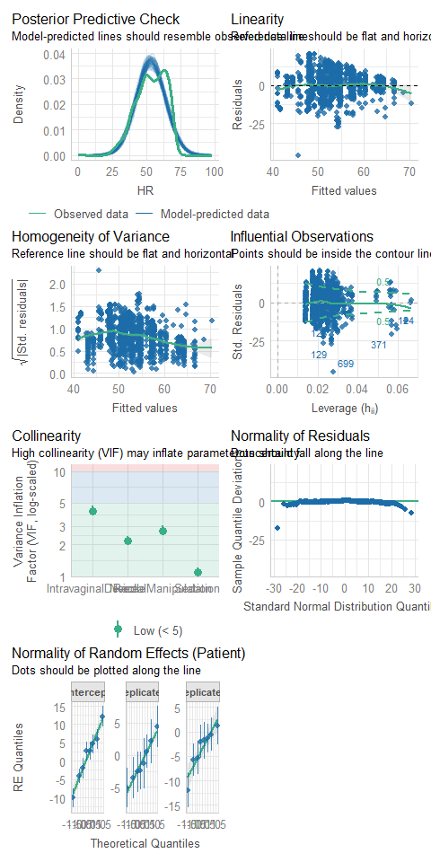

# Read data

``` r
load(file = "DATA/Cardiovascular.RData") 
cardiovascular = cardiovascular %>% 
    dplyr::select(Patient,Replicate,Time,Sedation,IntravaginalDevice,RectalManipulation,Needle,Puncturing,HousingEnvironment,HR) %>% 
    dplyr::mutate(Time =Time, 
                  Needle = as.factor(Needle),
                  HR = HR)
```

# Model building

##ModelOne

##ModelThree

``` r
cardiovascular = cardiovascular %>% 
    dplyr::select(Patient,Replicate,Time,Sedation,IntravaginalDevice,RectalManipulation,Needle,Puncturing,HousingEnvironment,HR) %>% 
    dplyr::mutate(Time = as.factor(Time), 
                  Needle = as.factor(Needle),
                  HousingEnvironment = as.factor(HousingEnvironment),
                  HR = HR
                )
```

``` r
cardiovascular %>% group_by(Patient,Replicate) %>% skim()
```

|                                                  |                    |
|:-------------------------------------------------|:-------------------|
| Name                                             | Piped data         |
| Number of rows                                   | 1405               |
| Number of columns                                | 10                 |
| \_\_\_\_\_\_\_\_\_\_\_\_\_\_\_\_\_\_\_\_\_\_\_   |                    |
| Column type frequency:                           |                    |
| factor                                           | 3                  |
| logical                                          | 4                  |
| numeric                                          | 1                  |
| \_\_\_\_\_\_\_\_\_\_\_\_\_\_\_\_\_\_\_\_\_\_\_\_ |                    |
| Group variables                                  | Patient, Replicate |

Data summary

**Variable type: factor**

| skim_variable      | Patient | Replicate | n_missing | complete_rate | ordered | n_unique | top_counts             |
|:------------|:-----|:-------|-------:|---------:|:-----|------:|:---------------|
| Time               | A       | 1         |         0 |             1 | FALSE   |       69 | 1: 1, 2: 1, 3: 1, 4: 1 |
| Time               | A       | 2         |         0 |             1 | FALSE   |       62 | 1: 1, 2: 1, 3: 1, 4: 1 |
| Time               | A       | 3         |         0 |             1 | FALSE   |       54 | 1: 1, 2: 1, 3: 1, 4: 1 |
| Time               | A       | NA        |        28 |             0 | FALSE   |        0 | 1: 0, 2: 0, 3: 0, 4: 0 |
| Time               | B       | 1         |         0 |             1 | FALSE   |       45 | 1: 1, 2: 1, 3: 1, 4: 1 |
| Time               | B       | 2         |         0 |             1 | FALSE   |       41 | 1: 1, 2: 1, 3: 1, 4: 1 |
| Time               | B       | 3         |         0 |             1 | FALSE   |       49 | 1: 1, 2: 1, 3: 1, 4: 1 |
| Time               | B       | NA        |        43 |             0 | FALSE   |        0 | 1: 0, 2: 0, 3: 0, 4: 0 |
| Time               | C       | 1         |         0 |             1 | FALSE   |       49 | 1: 1, 2: 1, 3: 1, 4: 1 |
| Time               | C       | 2         |         0 |             1 | FALSE   |       41 | 1: 1, 2: 1, 3: 1, 4: 1 |
| Time               | C       | 3         |         0 |             1 | FALSE   |       58 | 1: 1, 2: 1, 3: 1, 4: 1 |
| Time               | C       | NA        |        45 |             0 | FALSE   |        0 | 1: 0, 2: 0, 3: 0, 4: 0 |
| Time               | D       | 1         |         0 |             1 | FALSE   |       46 | 1: 1, 2: 1, 3: 1, 4: 1 |
| Time               | D       | 3         |         0 |             1 | FALSE   |       55 | 1: 1, 2: 1, 3: 1, 4: 1 |
| Time               | D       | NA        |        35 |             0 | FALSE   |        0 | 1: 0, 2: 0, 3: 0, 4: 0 |
| Time               | E       | 1         |         0 |             1 | FALSE   |       46 | 1: 1, 2: 1, 3: 1, 4: 1 |
| Time               | E       | 2         |         0 |             1 | FALSE   |       40 | 1: 1, 2: 1, 3: 1, 4: 1 |
| Time               | E       | 3         |         0 |             1 | FALSE   |       62 | 1: 1, 2: 1, 3: 1, 4: 1 |
| Time               | E       | NA        |        17 |             0 | FALSE   |        0 | 1: 0, 2: 0, 3: 0, 4: 0 |
| Time               | F       | 1         |         0 |             1 | FALSE   |       41 | 1: 1, 2: 1, 3: 1, 4: 1 |
| Time               | F       | 2         |         0 |             1 | FALSE   |       38 | 1: 1, 2: 1, 3: 1, 4: 1 |
| Time               | F       | 3         |         0 |             1 | FALSE   |       60 | 1: 1, 2: 1, 3: 1, 4: 1 |
| Time               | F       | NA        |        33 |             0 | FALSE   |        0 | 1: 0, 2: 0, 3: 0, 4: 0 |
| Time               | G       | 1         |         0 |             1 | FALSE   |       44 | 1: 1, 2: 1, 3: 1, 4: 1 |
| Time               | G       | 2         |         0 |             1 | FALSE   |       48 | 1: 1, 2: 1, 3: 1, 4: 1 |
| Time               | G       | 3         |         0 |             1 | FALSE   |       60 | 1: 1, 2: 1, 3: 1, 4: 1 |
| Time               | G       | NA        |        23 |             0 | FALSE   |        0 | 1: 0, 2: 0, 3: 0, 4: 0 |
| Time               | H       | 1         |         0 |             1 | FALSE   |       36 | 1: 1, 2: 1, 3: 1, 4: 1 |
| Time               | H       | 2         |         0 |             1 | FALSE   |       42 | 1: 1, 2: 1, 3: 1, 4: 1 |
| Time               | H       | 3         |         0 |             1 | FALSE   |       59 | 1: 1, 2: 1, 3: 1, 4: 1 |
| Time               | H       | NA        |        36 |             0 | FALSE   |        0 | 1: 0, 2: 0, 3: 0, 4: 0 |
| Needle             | A       | 1         |         0 |             1 | FALSE   |        2 | TRU: 52, FAL: 17       |
| Needle             | A       | 2         |         0 |             1 | FALSE   |        2 | TRU: 43, FAL: 19       |
| Needle             | A       | 3         |         0 |             1 | FALSE   |        1 | FAL: 54, TRU: 0        |
| Needle             | A       | NA        |         0 |             1 | FALSE   |        1 | FAL: 28, TRU: 0        |
| Needle             | B       | 1         |         0 |             1 | FALSE   |        2 | TRU: 25, FAL: 20       |
| Needle             | B       | 2         |         0 |             1 | FALSE   |        2 | TRU: 28, FAL: 13       |
| Needle             | B       | 3         |         0 |             1 | FALSE   |        1 | FAL: 49, TRU: 0        |
| Needle             | B       | NA        |         0 |             1 | FALSE   |        1 | FAL: 43, TRU: 0        |
| Needle             | C       | 1         |         0 |             1 | FALSE   |        2 | TRU: 28, FAL: 21       |
| Needle             | C       | 2         |         0 |             1 | FALSE   |        2 | TRU: 32, FAL: 9        |
| Needle             | C       | 3         |         0 |             1 | FALSE   |        1 | FAL: 58, TRU: 0        |
| Needle             | C       | NA        |         0 |             1 | FALSE   |        1 | FAL: 45, TRU: 0        |
| Needle             | D       | 1         |         0 |             1 | FALSE   |        2 | TRU: 35, FAL: 11       |
| Needle             | D       | 3         |         0 |             1 | FALSE   |        1 | FAL: 55, TRU: 0        |
| Needle             | D       | NA        |         0 |             1 | FALSE   |        1 | FAL: 35, TRU: 0        |
| Needle             | E       | 1         |         0 |             1 | FALSE   |        2 | TRU: 30, FAL: 16       |
| Needle             | E       | 2         |         0 |             1 | FALSE   |        2 | TRU: 28, FAL: 12       |
| Needle             | E       | 3         |         0 |             1 | FALSE   |        1 | FAL: 62, TRU: 0        |
| Needle             | E       | NA        |         0 |             1 | FALSE   |        1 | FAL: 17, TRU: 0        |
| Needle             | F       | 1         |         0 |             1 | FALSE   |        2 | TRU: 24, FAL: 17       |
| Needle             | F       | 2         |         0 |             1 | FALSE   |        2 | TRU: 20, FAL: 18       |
| Needle             | F       | 3         |         0 |             1 | FALSE   |        1 | FAL: 60, TRU: 0        |
| Needle             | F       | NA        |         0 |             1 | FALSE   |        1 | FAL: 33, TRU: 0        |
| Needle             | G       | 1         |         0 |             1 | FALSE   |        2 | TRU: 35, FAL: 9        |
| Needle             | G       | 2         |         0 |             1 | FALSE   |        2 | TRU: 29, FAL: 19       |
| Needle             | G       | 3         |         0 |             1 | FALSE   |        1 | FAL: 60, TRU: 0        |
| Needle             | G       | NA        |         0 |             1 | FALSE   |        1 | FAL: 23, TRU: 0        |
| Needle             | H       | 1         |         0 |             1 | FALSE   |        2 | TRU: 23, FAL: 13       |
| Needle             | H       | 2         |         0 |             1 | FALSE   |        2 | TRU: 29, FAL: 13       |
| Needle             | H       | 3         |         0 |             1 | FALSE   |        1 | FAL: 59, TRU: 0        |
| Needle             | H       | NA        |         0 |             1 | FALSE   |        1 | FAL: 36, TRU: 0        |
| HousingEnvironment | A       | 1         |         0 |             1 | FALSE   |        1 | sto: 69, sta: 0        |
| HousingEnvironment | A       | 2         |         0 |             1 | FALSE   |        1 | sto: 62, sta: 0        |
| HousingEnvironment | A       | 3         |         0 |             1 | FALSE   |        1 | sto: 54, sta: 0        |
| HousingEnvironment | A       | NA        |         0 |             1 | FALSE   |        1 | sta: 28, sto: 0        |
| HousingEnvironment | B       | 1         |         0 |             1 | FALSE   |        1 | sto: 45, sta: 0        |
| HousingEnvironment | B       | 2         |         0 |             1 | FALSE   |        1 | sto: 41, sta: 0        |
| HousingEnvironment | B       | 3         |         0 |             1 | FALSE   |        1 | sto: 49, sta: 0        |
| HousingEnvironment | B       | NA        |         0 |             1 | FALSE   |        1 | sta: 43, sto: 0        |
| HousingEnvironment | C       | 1         |         0 |             1 | FALSE   |        1 | sto: 49, sta: 0        |
| HousingEnvironment | C       | 2         |         0 |             1 | FALSE   |        1 | sto: 41, sta: 0        |
| HousingEnvironment | C       | 3         |         0 |             1 | FALSE   |        1 | sto: 58, sta: 0        |
| HousingEnvironment | C       | NA        |         0 |             1 | FALSE   |        1 | sta: 45, sto: 0        |
| HousingEnvironment | D       | 1         |         0 |             1 | FALSE   |        1 | sto: 46, sta: 0        |
| HousingEnvironment | D       | 3         |         0 |             1 | FALSE   |        1 | sto: 55, sta: 0        |
| HousingEnvironment | D       | NA        |         0 |             1 | FALSE   |        1 | sta: 35, sto: 0        |
| HousingEnvironment | E       | 1         |         0 |             1 | FALSE   |        1 | sto: 46, sta: 0        |
| HousingEnvironment | E       | 2         |         0 |             1 | FALSE   |        1 | sto: 40, sta: 0        |
| HousingEnvironment | E       | 3         |         0 |             1 | FALSE   |        1 | sto: 62, sta: 0        |
| HousingEnvironment | E       | NA        |         0 |             1 | FALSE   |        1 | sta: 17, sto: 0        |
| HousingEnvironment | F       | 1         |         0 |             1 | FALSE   |        1 | sto: 41, sta: 0        |
| HousingEnvironment | F       | 2         |         0 |             1 | FALSE   |        1 | sto: 38, sta: 0        |
| HousingEnvironment | F       | 3         |         0 |             1 | FALSE   |        1 | sto: 60, sta: 0        |
| HousingEnvironment | F       | NA        |         0 |             1 | FALSE   |        1 | sta: 33, sto: 0        |
| HousingEnvironment | G       | 1         |         0 |             1 | FALSE   |        1 | sto: 44, sta: 0        |
| HousingEnvironment | G       | 2         |         0 |             1 | FALSE   |        1 | sto: 48, sta: 0        |
| HousingEnvironment | G       | 3         |         0 |             1 | FALSE   |        1 | sto: 60, sta: 0        |
| HousingEnvironment | G       | NA        |         0 |             1 | FALSE   |        1 | sta: 23, sto: 0        |
| HousingEnvironment | H       | 1         |         0 |             1 | FALSE   |        1 | sto: 36, sta: 0        |
| HousingEnvironment | H       | 2         |         0 |             1 | FALSE   |        1 | sto: 42, sta: 0        |
| HousingEnvironment | H       | 3         |         0 |             1 | FALSE   |        1 | sto: 59, sta: 0        |
| HousingEnvironment | H       | NA        |         0 |             1 | FALSE   |        1 | sta: 36, sto: 0        |

**Variable type: logical**

| skim_variable      | Patient | Replicate | n_missing | complete_rate | mean | count            |
|:---------------|:-------|:--------|--------:|-----------:|----:|:--------------|
| Sedation           | A       | 1         |         0 |             1 | 0.94 | TRU: 65, FAL: 4  |
| Sedation           | A       | 2         |         0 |             1 | 0.95 | TRU: 59, FAL: 3  |
| Sedation           | A       | 3         |         0 |             1 | 0.93 | TRU: 50, FAL: 4  |
| Sedation           | A       | NA        |         0 |             1 | 0.00 | FAL: 28          |
| Sedation           | B       | 1         |         0 |             1 | 0.93 | TRU: 42, FAL: 3  |
| Sedation           | B       | 2         |         0 |             1 | 0.98 | TRU: 40, FAL: 1  |
| Sedation           | B       | 3         |         0 |             1 | 0.96 | TRU: 47, FAL: 2  |
| Sedation           | B       | NA        |         0 |             1 | 0.00 | FAL: 43          |
| Sedation           | C       | 1         |         0 |             1 | 0.96 | TRU: 47, FAL: 2  |
| Sedation           | C       | 2         |         0 |             1 | 0.98 | TRU: 40, FAL: 1  |
| Sedation           | C       | 3         |         0 |             1 | 0.97 | TRU: 56, FAL: 2  |
| Sedation           | C       | NA        |         0 |             1 | 0.00 | FAL: 45          |
| Sedation           | D       | 1         |         0 |             1 | 0.96 | TRU: 44, FAL: 2  |
| Sedation           | D       | 3         |         0 |             1 | 0.96 | TRU: 53, FAL: 2  |
| Sedation           | D       | NA        |         0 |             1 | 0.00 | FAL: 35          |
| Sedation           | E       | 1         |         0 |             1 | 0.96 | TRU: 44, FAL: 2  |
| Sedation           | E       | 2         |         0 |             1 | 0.98 | TRU: 39, FAL: 1  |
| Sedation           | E       | 3         |         0 |             1 | 0.89 | TRU: 55, FAL: 7  |
| Sedation           | E       | NA        |         0 |             1 | 0.00 | FAL: 17          |
| Sedation           | F       | 1         |         0 |             1 | 0.88 | TRU: 36, FAL: 5  |
| Sedation           | F       | 2         |         0 |             1 | 0.92 | TRU: 35, FAL: 3  |
| Sedation           | F       | 3         |         0 |             1 | 0.97 | TRU: 58, FAL: 2  |
| Sedation           | F       | NA        |         0 |             1 | 0.00 | FAL: 33          |
| Sedation           | G       | 1         |         0 |             1 | 0.95 | TRU: 42, FAL: 2  |
| Sedation           | G       | 2         |         0 |             1 | 0.98 | TRU: 47, FAL: 1  |
| Sedation           | G       | 3         |         0 |             1 | 0.97 | TRU: 58, FAL: 2  |
| Sedation           | G       | NA        |         0 |             1 | 0.00 | FAL: 23          |
| Sedation           | H       | 1         |         0 |             1 | 0.94 | TRU: 34, FAL: 2  |
| Sedation           | H       | 2         |         0 |             1 | 0.98 | TRU: 41, FAL: 1  |
| Sedation           | H       | 3         |         0 |             1 | 0.98 | TRU: 58, FAL: 1  |
| Sedation           | H       | NA        |         0 |             1 | 0.00 | FAL: 36          |
| IntravaginalDevice | A       | 1         |         0 |             1 | 0.75 | TRU: 52, FAL: 17 |
| IntravaginalDevice | A       | 2         |         0 |             1 | 0.69 | TRU: 43, FAL: 19 |
| IntravaginalDevice | A       | 3         |         0 |             1 | 0.70 | TRU: 38, FAL: 16 |
| IntravaginalDevice | A       | NA        |         0 |             1 | 0.00 | FAL: 28          |
| IntravaginalDevice | B       | 1         |         0 |             1 | 0.56 | TRU: 25, FAL: 20 |
| IntravaginalDevice | B       | 2         |         0 |             1 | 0.68 | TRU: 28, FAL: 13 |
| IntravaginalDevice | B       | 3         |         0 |             1 | 0.76 | TRU: 37, FAL: 12 |
| IntravaginalDevice | B       | NA        |         0 |             1 | 0.00 | FAL: 43          |
| IntravaginalDevice | C       | 1         |         0 |             1 | 0.57 | TRU: 28, FAL: 21 |
| IntravaginalDevice | C       | 2         |         0 |             1 | 0.78 | TRU: 32, FAL: 9  |
| IntravaginalDevice | C       | 3         |         0 |             1 | 0.74 | TRU: 43, FAL: 15 |
| IntravaginalDevice | C       | NA        |         0 |             1 | 0.00 | FAL: 45          |
| IntravaginalDevice | D       | 1         |         0 |             1 | 0.76 | TRU: 35, FAL: 11 |
| IntravaginalDevice | D       | 3         |         0 |             1 | 0.78 | TRU: 43, FAL: 12 |
| IntravaginalDevice | D       | NA        |         0 |             1 | 0.00 | FAL: 35          |
| IntravaginalDevice | E       | 1         |         0 |             1 | 0.65 | TRU: 30, FAL: 16 |
| IntravaginalDevice | E       | 2         |         0 |             1 | 0.70 | TRU: 28, FAL: 12 |
| IntravaginalDevice | E       | 3         |         0 |             1 | 0.73 | TRU: 45, FAL: 17 |
| IntravaginalDevice | E       | NA        |         0 |             1 | 0.00 | FAL: 17          |
| IntravaginalDevice | F       | 1         |         0 |             1 | 0.59 | TRU: 24, FAL: 17 |
| IntravaginalDevice | F       | 2         |         0 |             1 | 0.53 | TRU: 20, FAL: 18 |
| IntravaginalDevice | F       | 3         |         0 |             1 | 0.67 | TRU: 40, FAL: 20 |
| IntravaginalDevice | F       | NA        |         0 |             1 | 0.00 | FAL: 33          |
| IntravaginalDevice | G       | 1         |         0 |             1 | 0.80 | TRU: 35, FAL: 9  |
| IntravaginalDevice | G       | 2         |         0 |             1 | 0.60 | TRU: 29, FAL: 19 |
| IntravaginalDevice | G       | 3         |         0 |             1 | 0.72 | TRU: 43, FAL: 17 |
| IntravaginalDevice | G       | NA        |         0 |             1 | 0.00 | FAL: 23          |
| IntravaginalDevice | H       | 1         |         0 |             1 | 0.64 | TRU: 23, FAL: 13 |
| IntravaginalDevice | H       | 2         |         0 |             1 | 0.69 | TRU: 29, FAL: 13 |
| IntravaginalDevice | H       | 3         |         0 |             1 | 0.71 | TRU: 42, FAL: 17 |
| IntravaginalDevice | H       | NA        |         0 |             1 | 0.00 | FAL: 36          |
| RectalManipulation | A       | 1         |         0 |             1 | 0.62 | TRU: 43, FAL: 26 |
| RectalManipulation | A       | 2         |         0 |             1 | 0.60 | TRU: 37, FAL: 25 |
| RectalManipulation | A       | 3         |         0 |             1 | 0.65 | TRU: 35, FAL: 19 |
| RectalManipulation | A       | NA        |         0 |             1 | 0.00 | FAL: 28          |
| RectalManipulation | B       | 1         |         0 |             1 | 0.44 | FAL: 25, TRU: 20 |
| RectalManipulation | B       | 2         |         0 |             1 | 0.51 | TRU: 21, FAL: 20 |
| RectalManipulation | B       | 3         |         0 |             1 | 0.65 | TRU: 32, FAL: 17 |
| RectalManipulation | B       | NA        |         0 |             1 | 0.00 | FAL: 43          |
| RectalManipulation | C       | 1         |         0 |             1 | 0.49 | FAL: 25, TRU: 24 |
| RectalManipulation | C       | 2         |         0 |             1 | 0.66 | TRU: 27, FAL: 14 |
| RectalManipulation | C       | 3         |         0 |             1 | 0.67 | TRU: 39, FAL: 19 |
| RectalManipulation | C       | NA        |         0 |             1 | 0.00 | FAL: 45          |
| RectalManipulation | D       | 1         |         0 |             1 | 0.67 | TRU: 31, FAL: 15 |
| RectalManipulation | D       | 3         |         0 |             1 | 0.75 | TRU: 41, FAL: 14 |
| RectalManipulation | D       | NA        |         0 |             1 | 0.00 | FAL: 35          |
| RectalManipulation | E       | 1         |         0 |             1 | 0.54 | TRU: 25, FAL: 21 |
| RectalManipulation | E       | 2         |         0 |             1 | 0.58 | TRU: 23, FAL: 17 |
| RectalManipulation | E       | 3         |         0 |             1 | 0.66 | TRU: 41, FAL: 21 |
| RectalManipulation | E       | NA        |         0 |             1 | 0.00 | FAL: 17          |
| RectalManipulation | F       | 1         |         0 |             1 | 0.54 | TRU: 22, FAL: 19 |
| RectalManipulation | F       | 2         |         0 |             1 | 0.47 | FAL: 20, TRU: 18 |
| RectalManipulation | F       | 3         |         0 |             1 | 0.62 | TRU: 37, FAL: 23 |
| RectalManipulation | F       | NA        |         0 |             1 | 0.00 | FAL: 33          |
| RectalManipulation | G       | 1         |         0 |             1 | 0.64 | TRU: 28, FAL: 16 |
| RectalManipulation | G       | 2         |         0 |             1 | 0.54 | TRU: 26, FAL: 22 |
| RectalManipulation | G       | 3         |         0 |             1 | 0.67 | TRU: 40, FAL: 20 |
| RectalManipulation | G       | NA        |         0 |             1 | 0.00 | FAL: 23          |
| RectalManipulation | H       | 1         |         0 |             1 | 0.53 | TRU: 19, FAL: 17 |
| RectalManipulation | H       | 2         |         0 |             1 | 0.57 | TRU: 24, FAL: 18 |
| RectalManipulation | H       | 3         |         0 |             1 | 0.66 | TRU: 39, FAL: 20 |
| RectalManipulation | H       | NA        |         0 |             1 | 0.00 | FAL: 36          |
| Puncturing         | A       | 1         |         0 |             1 | 0.07 | FAL: 64, TRU: 5  |
| Puncturing         | A       | 2         |         0 |             1 | 0.10 | FAL: 56, TRU: 6  |
| Puncturing         | A       | 3         |         0 |             1 | 0.00 | FAL: 54          |
| Puncturing         | A       | NA        |         0 |             1 | 0.00 | FAL: 28          |
| Puncturing         | B       | 1         |         0 |             1 | 0.13 | FAL: 39, TRU: 6  |
| Puncturing         | B       | 2         |         0 |             1 | 0.15 | FAL: 35, TRU: 6  |
| Puncturing         | B       | 3         |         0 |             1 | 0.00 | FAL: 49          |
| Puncturing         | B       | NA        |         0 |             1 | 0.00 | FAL: 43          |
| Puncturing         | C       | 1         |         0 |             1 | 0.12 | FAL: 43, TRU: 6  |
| Puncturing         | C       | 2         |         0 |             1 | 0.20 | FAL: 33, TRU: 8  |
| Puncturing         | C       | 3         |         0 |             1 | 0.00 | FAL: 58          |
| Puncturing         | C       | NA        |         0 |             1 | 0.00 | FAL: 45          |
| Puncturing         | D       | 1         |         0 |             1 | 0.15 | FAL: 39, TRU: 7  |
| Puncturing         | D       | 3         |         0 |             1 | 0.00 | FAL: 55          |
| Puncturing         | D       | NA        |         0 |             1 | 0.00 | FAL: 35          |
| Puncturing         | E       | 1         |         0 |             1 | 0.11 | FAL: 41, TRU: 5  |
| Puncturing         | E       | 2         |         0 |             1 | 0.12 | FAL: 35, TRU: 5  |
| Puncturing         | E       | 3         |         0 |             1 | 0.00 | FAL: 62          |
| Puncturing         | E       | NA        |         0 |             1 | 0.00 | FAL: 17          |
| Puncturing         | F       | 1         |         0 |             1 | 0.12 | FAL: 36, TRU: 5  |
| Puncturing         | F       | 2         |         0 |             1 | 0.13 | FAL: 33, TRU: 5  |
| Puncturing         | F       | 3         |         0 |             1 | 0.00 | FAL: 60          |
| Puncturing         | F       | NA        |         0 |             1 | 0.00 | FAL: 33          |
| Puncturing         | G       | 1         |         0 |             1 | 0.11 | FAL: 39, TRU: 5  |
| Puncturing         | G       | 2         |         0 |             1 | 0.12 | FAL: 42, TRU: 6  |
| Puncturing         | G       | 3         |         0 |             1 | 0.00 | FAL: 60          |
| Puncturing         | G       | NA        |         0 |             1 | 0.00 | FAL: 23          |
| Puncturing         | H       | 1         |         0 |             1 | 0.17 | FAL: 30, TRU: 6  |
| Puncturing         | H       | 2         |         0 |             1 | 0.19 | FAL: 34, TRU: 8  |
| Puncturing         | H       | 3         |         0 |             1 | 0.00 | FAL: 59          |
| Puncturing         | H       | NA        |         0 |             1 | 0.00 | FAL: 36          |

**Variable type: numeric**

| skim_variable | Patient | Replicate | n_missing | complete_rate |  mean |    sd |    p0 |   p25 |   p50 |   p75 |  p100 | hist  |
|:--------|:-----|:------|------:|--------:|----:|----:|----:|----:|----:|----:|----:|:----|
| HR            | A       | 1         |         1 |          0.99 | 50.25 |  9.52 | 30.09 | 46.83 | 50.89 | 57.00 | 63.49 | ▅▁▇▇▇ |
| HR            | A       | 2         |         2 |          0.97 | 50.14 | 10.48 | 38.56 | 40.12 | 48.11 | 60.10 | 68.71 | ▇▂▂▂▃ |
| HR            | A       | 3         |         2 |          0.96 | 48.19 |  8.81 | 33.76 | 40.63 | 45.01 | 56.44 | 67.36 | ▆▇▃▃▃ |
| HR            | A       | NA        |         0 |          1.00 | 41.10 |  3.73 | 33.83 | 38.11 | 40.80 | 43.54 | 48.06 | ▃▇▆▇▃ |
| HR            | B       | 1         |        13 |          0.71 | 65.51 |  4.26 | 54.09 | 63.74 | 67.06 | 68.47 | 69.86 | ▁▁▁▂▇ |
| HR            | B       | 2         |         9 |          0.78 | 63.67 |  4.55 | 48.28 | 61.21 | 64.51 | 67.12 | 69.65 | ▁▁▃▆▇ |
| HR            | B       | 3         |         8 |          0.84 | 64.28 |  3.42 | 52.04 | 62.17 | 64.94 | 67.09 | 68.68 | ▁▁▃▆▇ |
| HR            | B       | NA        |         0 |          1.00 | 37.32 |  3.68 | 30.72 | 34.75 | 37.89 | 40.52 | 43.45 | ▆▇▆▇▆ |
| HR            | C       | 1         |         6 |          0.88 | 59.48 |  7.76 | 37.86 | 56.45 | 61.69 | 64.45 | 69.52 | ▂▁▂▇▇ |
| HR            | C       | 2         |        13 |          0.68 | 51.98 | 11.65 | 27.23 | 49.39 | 55.56 | 60.68 | 65.78 | ▃▁▁▇▇ |
| HR            | C       | 3         |         3 |          0.95 | 52.54 |  9.23 | 33.78 | 44.68 | 53.28 | 60.04 | 68.82 | ▃▆▆▇▃ |
| HR            | C       | NA        |         0 |          1.00 | 35.17 |  2.19 | 31.88 | 33.38 | 34.90 | 36.80 | 40.66 | ▆▇▅▅▁ |
| HR            | D       | 1         |         3 |          0.93 | 56.85 |  6.38 | 40.69 | 52.37 | 56.01 | 61.18 | 69.33 | ▁▆▇▆▃ |
| HR            | D       | 3         |         2 |          0.96 | 54.20 |  6.93 | 36.83 | 49.69 | 53.19 | 57.92 | 66.95 | ▁▃▇▅▃ |
| HR            | D       | NA        |         0 |          1.00 | 39.60 |  3.44 | 32.88 | 36.93 | 39.93 | 41.53 | 47.77 | ▃▅▇▅▁ |
| HR            | E       | 1         |        15 |          0.67 | 52.00 |  7.18 | 40.66 | 45.72 | 51.97 | 57.76 | 64.50 | ▇▃▇▇▃ |
| HR            | E       | 2         |        21 |          0.48 | 55.70 |  6.17 | 45.83 | 51.45 | 54.35 | 59.30 | 66.90 | ▆▇▆▃▆ |
| HR            | E       | 3         |        27 |          0.56 | 52.97 |  7.91 | 36.44 | 47.08 | 52.13 | 58.97 | 67.34 | ▁▇▅▅▃ |
| HR            | E       | NA        |         0 |          1.00 | 38.62 |  3.34 | 33.25 | 36.50 | 38.76 | 40.94 | 43.56 | ▆▆▇▇▆ |
| HR            | F       | 1         |         5 |          0.88 | 43.95 | 10.43 | 25.58 | 42.33 | 48.34 | 49.33 | 63.13 | ▃▁▃▇▁ |
| HR            | F       | 2         |         9 |          0.76 | 48.58 |  5.91 | 28.47 | 45.77 | 50.80 | 51.39 | 62.69 | ▁▂▃▇▁ |
| HR            | F       | 3         |         2 |          0.97 | 42.43 |  5.88 | 27.60 | 38.90 | 43.14 | 48.03 | 49.57 | ▂▂▆▃▇ |
| HR            | F       | NA        |         0 |          1.00 | 28.89 |  3.15 | 23.82 | 26.59 | 27.77 | 31.03 | 36.01 | ▃▇▃▂▂ |
| HR            | G       | 1         |         2 |          0.95 | 57.39 | 12.90 | 27.21 | 55.22 | 62.37 | 66.39 | 69.27 | ▂▁▁▃▇ |
| HR            | G       | 2         |         3 |          0.94 | 53.66 |  8.77 | 39.03 | 46.14 | 51.37 | 62.14 | 67.89 | ▅▇▅▃▇ |
| HR            | G       | 3         |         6 |          0.90 | 50.88 | 10.93 | 35.09 | 41.43 | 48.94 | 61.03 | 69.73 | ▇▆▅▅▆ |
| HR            | G       | NA        |         0 |          1.00 | 36.73 |  4.39 | 29.46 | 34.15 | 35.98 | 39.10 | 48.16 | ▆▇▇▃▁ |
| HR            | H       | 1         |         3 |          0.92 | 59.91 |  7.99 | 38.15 | 57.24 | 61.52 | 65.96 | 67.86 | ▂▁▁▆▇ |
| HR            | H       | 2         |         2 |          0.95 | 58.08 |  7.28 | 45.09 | 51.04 | 58.55 | 63.94 | 69.52 | ▇▅▆▇▇ |
| HR            | H       | 3         |        13 |          0.78 | 46.67 | 14.55 |  0.00 | 34.27 | 46.33 | 58.31 | 68.62 | ▁▁▇▃▆ |
| HR            | H       | NA        |         0 |          1.00 | 45.54 |  3.92 | 36.41 | 43.57 | 46.47 | 48.15 | 51.39 | ▁▅▅▇▅ |

``` r
cardiovascularStocks = cardiovascular %>% filter( HousingEnvironment == "stocks")
ModelStocks = lmer(HR ~ Sedation+IntravaginalDevice+RectalManipulation+Needle + (1 + Replicate|Patient), data = cardiovascularStocks)
```

``` r
summary(ModelStocks)
```

    ## Linear mixed model fit by REML. t-tests use Satterthwaite's method [
    ## lmerModLmerTest]
    ## Formula: HR ~ Sedation + IntravaginalDevice + RectalManipulation + Needle +  
    ##     (1 + Replicate | Patient)
    ##    Data: cardiovascularStocks
    ## 
    ## REML criterion at convergence: 7032.9
    ## 
    ## Scaled residuals: 
    ##     Min      1Q  Median      3Q     Max 
    ## -5.2276 -0.6544  0.0714  0.6475  2.3675 
    ## 
    ## Random effects:
    ##  Groups   Name        Variance Std.Dev. Corr       
    ##  Patient  (Intercept) 47.19    6.870               
    ##           Replicate2  12.38    3.518    -0.81      
    ##           Replicate3  30.69    5.540    -0.47  0.60
    ##  Residual             76.29    8.734               
    ## Number of obs: 975, groups:  Patient, 8
    ## 
    ## Fixed effects:
    ##                        Estimate Std. Error       df t value Pr(>|t|)    
    ## (Intercept)             60.1620     2.3785  29.1912  25.294  < 2e-16 ***
    ## SedationTRUE            -8.4467     1.8053 953.6480  -4.679  3.3e-06 ***
    ## IntravaginalDeviceTRUE   1.8435     1.3503 550.2601   1.365    0.173    
    ## RectalManipulationTRUE   0.4367     0.9884 950.6490   0.442    0.659    
    ## NeedleTRUE               0.5597     1.1652  86.6611   0.480    0.632    
    ## ---
    ## Signif. codes:  0 '***' 0.001 '**' 0.01 '*' 0.05 '.' 0.1 ' ' 1
    ## 
    ## Correlation of Fixed Effects:
    ##             (Intr) SdTRUE IDTRUE RMTRUE
    ## SedatinTRUE -0.679                     
    ## IntrvgDTRUE  0.037 -0.143              
    ## RctlMnpTRUE  0.006  0.002 -0.678       
    ## NeedleTRUE  -0.074 -0.020 -0.570  0.065

``` r
check_model(ModelStocks)
```



``` r
model_performance(ModelStocks)
```

    ## # Indices of model performance
    ## 
    ## AIC      |     AICc |      BIC | R2 (cond.) | R2 (marg.) |   ICC |  RMSE | Sigma
    ## --------------------------------------------------------------------------------
    ## 7056.918 | 7057.242 | 7115.507 |      0.393 |      0.018 | 0.382 | 8.631 | 8.734

``` r
cardiovascular = cardiovascular %>% dplyr::mutate( PatientReplicate = paste(Replicate,Patient))
  
ModelStable = lmer(HR ~ Sedation +  HousingEnvironment+ (1|PatientReplicate), data = cardiovascular)
```

``` r
summary(ModelStable)
```

    ## Linear mixed model fit by REML. t-tests use Satterthwaite's method [
    ## lmerModLmerTest]
    ## Formula: HR ~ Sedation + HousingEnvironment + (1 | PatientReplicate)
    ##    Data: cardiovascular
    ## 
    ## REML criterion at convergence: 8714.6
    ## 
    ## Scaled residuals: 
    ##     Min      1Q  Median      3Q     Max 
    ## -5.8915 -0.5581  0.0768  0.6148  2.7191 
    ## 
    ## Random effects:
    ##  Groups           Name        Variance Std.Dev.
    ##  PatientReplicate (Intercept) 33.52    5.790   
    ##  Residual                     63.50    7.969   
    ## Number of obs: 1235, groups:  PatientReplicate, 31
    ## 
    ## Fixed effects:
    ##                          Estimate Std. Error       df t value Pr(>|t|)    
    ## (Intercept)                60.033      1.968  175.052  30.512  < 2e-16 ***
    ## SedationTRUE               -6.346      1.573 1205.610  -4.035 5.81e-05 ***
    ## HousingEnvironmentstable  -22.170      2.886   56.893  -7.683 2.34e-10 ***
    ## ---
    ## Signif. codes:  0 '***' 0.001 '**' 0.01 '*' 0.05 '.' 0.1 ' ' 1
    ## 
    ## Correlation of Fixed Effects:
    ##             (Intr) SdTRUE
    ## SedatinTRUE -0.778       
    ## HsngEnvrnmn -0.682  0.530

``` r
check_model(ModelStable)
```


``` r
model_performance(ModelStable)
```

    ## # Indices of model performance
    ## 
    ## AIC      |     AICc |      BIC | R2 (cond.) | R2 (marg.) |   ICC |  RMSE | Sigma
    ## --------------------------------------------------------------------------------
    ## 8724.584 | 8724.633 | 8750.179 |      0.548 |      0.309 | 0.345 | 7.870 | 7.969
