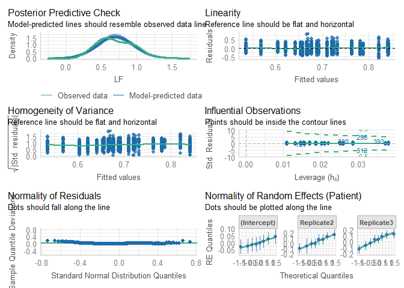

# Read data

``` r
load(file = "DATA/Cardiovascular.RData") 
cardiovascular = cardiovascular %>% 
    dplyr::select(Patient,Replicate,Time,Sedation,IntravaginalDevice,RectalManipulation,Puncturing,Needle,LF) %>% 
    dplyr::mutate(Time = as.factor(Time), 
                  Needle = as.factor(Needle),
                  LF = sqrt(LF)) %>%
    filter(IntravaginalDevice == TRUE)
```

# Model building

``` r
Model = lmer(LF ~ Needle + (1 + Replicate|Patient), data = cardiovascular)
```

``` r
summary(Model)
```

    ## Linear mixed model fit by REML. t-tests use Satterthwaite's method [
    ## lmerModLmerTest]
    ## Formula: LF ~ Needle + (1 + Replicate | Patient)
    ##    Data: cardiovascular
    ## 
    ## REML criterion at convergence: -16.6
    ## 
    ## Scaled residuals: 
    ##     Min      1Q  Median      3Q     Max 
    ## -2.5203 -0.7743 -0.0980  0.7241  3.5996 
    ## 
    ## Random effects:
    ##  Groups   Name        Variance Std.Dev. Corr       
    ##  Patient  (Intercept) 0.001305 0.03612             
    ##           Replicate2  0.011113 0.10542  -0.08      
    ##           Replicate3  0.009118 0.09549   0.16  0.81
    ##  Residual             0.054316 0.23306             
    ## Number of obs: 736, groups:  Patient, 8
    ## 
    ## Fixed effects:
    ##             Estimate Std. Error       df t value Pr(>|t|)    
    ## (Intercept) 0.673665   0.033868 6.866344  19.891 2.52e-07 ***
    ## NeedleTRUE  0.008727   0.027917 6.779069   0.313    0.764    
    ## ---
    ## Signif. codes:  0 '***' 0.001 '**' 0.01 '*' 0.05 '.' 0.1 ' ' 1
    ## 
    ## Correlation of Fixed Effects:
    ##            (Intr)
    ## NeedleTRUE -0.829

``` r
check_model(Model)
```


