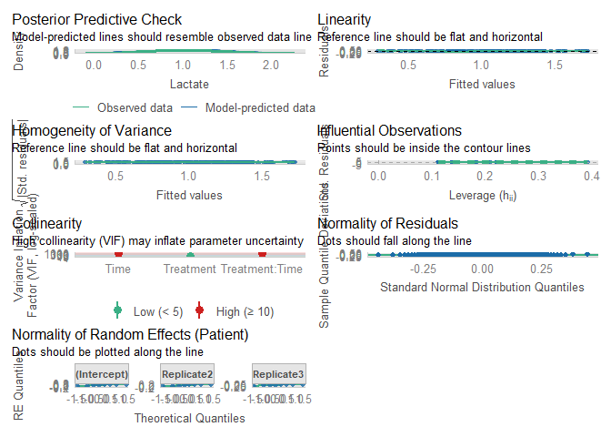

# Read data

``` r
load(file = "DATA/Data.RData") 
Data = Data %>% 
  dplyr::select(Patient,Treatment,Replicate,HousingEnvironment,Punctures,Time,Manipulation,Lactate,cumulativepunctures) %>%  
  dplyr::mutate(Time = as.factor(Time), Treatment= as.factor(Treatment)) 
```

# Model building

``` r
Model = lmer(Lactate ~ Treatment*Time + (1 + Replicate|Patient), data = Data)
```

    ## fixed-effect model matrix is rank deficient so dropping 1 column / coefficient

    ## boundary (singular) fit: see help('isSingular')

``` r
summary(Model)
```

    ## Linear mixed model fit by REML. t-tests use Satterthwaite's method [
    ## lmerModLmerTest]
    ## Formula: Lactate ~ Treatment * Time + (1 + Replicate | Patient)
    ##    Data: Data
    ## 
    ## REML criterion at convergence: -36.6
    ## 
    ## Scaled residuals: 
    ##      Min       1Q   Median       3Q      Max 
    ## -2.52288 -0.53647 -0.04201  0.53524  2.93155 
    ## 
    ## Random effects:
    ##  Groups   Name        Variance Std.Dev. Corr       
    ##  Patient  (Intercept) 0.01969  0.1403              
    ##           Replicate2  0.02215  0.1488    0.61      
    ##           Replicate3  0.03433  0.1853   -0.39  0.49
    ##  Residual             0.03024  0.1739              
    ## Number of obs: 186, groups:  Patient, 8
    ## 
    ## Fixed effects:
    ##                          Estimate Std. Error         df t value Pr(>|t|)    
    ## (Intercept)              0.680259   0.095192 109.451275   7.146 1.05e-10 ***
    ## TreatmentTRUE           -0.052679   0.094659  32.939957  -0.557  0.58162    
    ## Time-10                  0.804375   0.106498 153.264417   7.553 3.58e-12 ***
    ## Time0                    0.656875   0.106498 153.264417   6.168 5.88e-09 ***
    ## Time10                   0.508125   0.106498 153.264417   4.771 4.23e-06 ***
    ## Time20                   0.443125   0.106498 153.264417   4.161 5.27e-05 ***
    ## Time30                   0.379375   0.106498 153.264417   3.562  0.00049 ***
    ## Time40                   0.303125   0.106498 153.264417   2.846  0.00503 ** 
    ## Time1440                -0.103125   0.106498 153.264417  -0.968  0.33441    
    ## Time4320                -0.066875   0.061487 153.264417  -1.088  0.27846    
    ## TreatmentTRUE:Time-10   -0.165625   0.106498 153.264417  -1.555  0.12196    
    ## TreatmentTRUE:Time0     -0.055625   0.106498 153.264417  -0.522  0.60221    
    ## TreatmentTRUE:Time10    -0.027500   0.106498 153.264417  -0.258  0.79658    
    ## TreatmentTRUE:Time20    -0.061250   0.106498 153.264417  -0.575  0.56605    
    ## TreatmentTRUE:Time30    -0.077413   0.118534 153.918172  -0.653  0.51467    
    ## TreatmentTRUE:Time40    -0.007908   0.142783 154.325325  -0.055  0.95590    
    ## TreatmentTRUE:Time1440   0.244375   0.106498 153.264417   2.295  0.02311 *  
    ## ---
    ## Signif. codes:  0 '***' 0.001 '**' 0.01 '*' 0.05 '.' 0.1 ' ' 1

    ## 
    ## Correlation matrix not shown by default, as p = 17 > 12.
    ## Use print(x, correlation=TRUE)  or
    ##     vcov(x)        if you need it

    ## fit warnings:
    ## fixed-effect model matrix is rank deficient so dropping 1 column / coefficient
    ## optimizer (nloptwrap) convergence code: 0 (OK)
    ## boundary (singular) fit: see help('isSingular')

``` r
check_model(Model)
```



``` r
PlotData = get_model_data(Model, type= "emm", terms= c("Time","Treatment")) 
PlotData = as.data.frame(PlotData) %>% dplyr::mutate( 
   groupString = as.character(group),
    x = case_when(
    x == -1440 & groupString == "FALSE" ~ x - 40 ,
    x == -1440 & groupString == "TRUE" ~ x + 40,
    x == 1440 & groupString == "FALSE" ~ x - 40 ,
    x == 1440 & groupString == "TRUE" ~ x + 40,
    x == 4320 & groupString == "FALSE" ~ x - 40 ,
    x == 4320 & groupString == "TRUE" ~ x + 40,
    TRUE ~ x)
)

LactatePlot = ggplot(data = PlotData,aes(x= x, y=predicted, color = group))+ 
  geom_point(position = position_dodge(2),size = 3) +
  facet_zoom(xlim = c(-10, 50)) +
  geom_linerange(size = 1, aes(ymin = conf.low, ymax = conf.high,colour = group),position = position_dodge(2)) +    
  xlab("Time") + 
  ylab("Lactate (mmol/L)") + 
  scale_x_continuous(labels=c("Day -1",expression(T[scriptstyle(-10)]),expression(T[scriptstyle(0)]),expression(T[scriptstyle(10)]),expression(T[scriptstyle(20)]),expression(T[scriptstyle(30)]),expression(T[scriptstyle(40)]),"Day 1","Day 3"), breaks = c(-1440,-10,0,10,20,30,40,1440,4320)) + theme(legend.position = "Top",legend.title = element_text("Puncture"))
```

    ## Warning: Using `size` aesthetic for lines was deprecated in ggplot2 3.4.0.
    ## ℹ Please use `linewidth` instead.
    ## This warning is displayed once every 8 hours.
    ## Call `lifecycle::last_lifecycle_warnings()` to see where this warning was
    ## generated.

``` r
LactatePlot = LactatePlot+ theme_grey(base_size = 20) + 
  labs(color = "")+
  scale_color_discrete(labels=c(expression("P"^"-"), expression("P"^"+")))+
  theme(legend.position = "top") 
LactatePlot
```

    ## Warning: Removed 2 rows containing missing values or values outside the scale range
    ## (`geom_point()`).

    ## Warning: Removed 1 row containing missing values or values outside the scale range
    ## (`geom_segment()`).
    ## Removed 1 row containing missing values or values outside the scale range
    ## (`geom_segment()`).


``` r
ggsave(plot = LactatePlot,
       filename = "LactatePlot.png",
       path= "FIGURES/",
       width = 10,
       height = 7)
```

    ## Warning: Removed 2 rows containing missing values or values outside the scale range
    ## (`geom_point()`).

    ## Warning: Removed 1 row containing missing values or values outside the scale range
    ## (`geom_segment()`).
    ## Removed 1 row containing missing values or values outside the scale range
    ## (`geom_segment()`).

``` r
emmeans(Model, pairwise ~ Time|Treatment)
```

    ## $emmeans
    ## Treatment = FALSE:
    ##  Time  emmean     SE   df lower.CL upper.CL
    ##  -1440 nonEst     NA   NA       NA       NA
    ##  -10    1.485 0.0774 41.9    1.328    1.641
    ##  0      1.337 0.0774 41.9    1.181    1.493
    ##  10     1.188 0.0774 41.9    1.032    1.345
    ##  20     1.123 0.0774 41.9    0.967    1.280
    ##  30     1.060 0.0774 41.9    0.903    1.216
    ##  40     0.983 0.0774 41.9    0.827    1.140
    ##  1440   0.577 0.0774 41.9    0.421    0.733
    ##  4320   0.613 0.0774 41.9    0.457    0.770
    ## 
    ## Treatment = TRUE:
    ##  Time  emmean     SE   df lower.CL upper.CL
    ##  -1440  0.628 0.0709 18.1    0.479    0.776
    ##  -10    1.266 0.0709 18.1    1.117    1.415
    ##  0      1.229 0.0709 18.1    1.080    1.378
    ##  10     1.108 0.0709 18.1    0.959    1.257
    ##  20     1.009 0.0709 18.1    0.861    1.158
    ##  30     0.930 0.0878 41.1    0.752    1.107
    ##  40     0.923 0.1209 99.8    0.683    1.163
    ##  1440   0.769 0.0709 18.1    0.620    0.918
    ##  4320   0.561 0.0709 18.1    0.412    0.710
    ## 
    ## Degrees-of-freedom method: kenward-roger 
    ## Confidence level used: 0.95 
    ## 
    ## $contrasts
    ## Treatment = FALSE:
    ##  contrast                estimate     SE  df t.ratio p.value
    ##  (Time-1440) - (Time-10)   nonEst     NA  NA      NA      NA
    ##  (Time-1440) - Time0       nonEst     NA  NA      NA      NA
    ##  (Time-1440) - Time10      nonEst     NA  NA      NA      NA
    ##  (Time-1440) - Time20      nonEst     NA  NA      NA      NA
    ##  (Time-1440) - Time30      nonEst     NA  NA      NA      NA
    ##  (Time-1440) - Time40      nonEst     NA  NA      NA      NA
    ##  (Time-1440) - Time1440    nonEst     NA  NA      NA      NA
    ##  (Time-1440) - Time4320    nonEst     NA  NA      NA      NA
    ##  (Time-10) - Time0        0.14750 0.0870 148   1.696  0.6897
    ##  (Time-10) - Time10       0.29625 0.0870 148   3.407  0.0187
    ##  (Time-10) - Time20       0.36125 0.0870 148   4.154  0.0014
    ##  (Time-10) - Time30       0.42500 0.0870 148   4.888  0.0001
    ##  (Time-10) - Time40       0.50125 0.0870 148   5.764  <.0001
    ##  (Time-10) - Time1440     0.90750 0.0870 148  10.436  <.0001
    ##  (Time-10) - Time4320     0.87125 0.0870 148  10.020  <.0001
    ##  Time0 - Time10           0.14875 0.0870 148   1.711  0.6804
    ##  Time0 - Time20           0.21375 0.0870 148   2.458  0.2219
    ##  Time0 - Time30           0.27750 0.0870 148   3.191  0.0359
    ##  Time0 - Time40           0.35375 0.0870 148   4.068  0.0019
    ##  Time0 - Time1440         0.76000 0.0870 148   8.740  <.0001
    ##  Time0 - Time4320         0.72375 0.0870 148   8.323  <.0001
    ##  Time10 - Time20          0.06500 0.0870 148   0.748  0.9953
    ##  Time10 - Time30          0.12875 0.0870 148   1.481  0.8166
    ##  Time10 - Time40          0.20500 0.0870 148   2.358  0.2703
    ##  Time10 - Time1440        0.61125 0.0870 148   7.029  <.0001
    ##  Time10 - Time4320        0.57500 0.0870 148   6.613  <.0001
    ##  Time20 - Time30          0.06375 0.0870 148   0.733  0.9958
    ##  Time20 - Time40          0.14000 0.0870 148   1.610  0.7436
    ##  Time20 - Time1440        0.54625 0.0870 148   6.282  <.0001
    ##  Time20 - Time4320        0.51000 0.0870 148   5.865  <.0001
    ##  Time30 - Time40          0.07625 0.0870 148   0.877  0.9877
    ##  Time30 - Time1440        0.48250 0.0870 148   5.549  <.0001
    ##  Time30 - Time4320        0.44625 0.0870 148   5.132  <.0001
    ##  Time40 - Time1440        0.40625 0.0870 148   4.672  0.0002
    ##  Time40 - Time4320        0.37000 0.0870 148   4.255  0.0009
    ##  Time1440 - Time4320     -0.03625 0.0870 148  -0.417  0.9999
    ## 
    ## Treatment = TRUE:
    ##  contrast                estimate     SE  df t.ratio p.value
    ##  (Time-1440) - (Time-10) -0.63875 0.0615 148 -10.388  <.0001
    ##  (Time-1440) - Time0     -0.60125 0.0615 148  -9.779  <.0001
    ##  (Time-1440) - Time10    -0.48063 0.0615 148  -7.817  <.0001
    ##  (Time-1440) - Time20    -0.38188 0.0615 148  -6.211  <.0001
    ##  (Time-1440) - Time30    -0.30196 0.0811 151  -3.725  0.0082
    ##  (Time-1440) - Time40    -0.29522 0.1145 153  -2.578  0.2048
    ##  (Time-1440) - Time1440  -0.14125 0.0615 148  -2.297  0.3506
    ##  (Time-1440) - Time4320   0.06688 0.0615 148   1.088  0.9752
    ##  (Time-10) - Time0        0.03750 0.0615 148   0.610  0.9995
    ##  (Time-10) - Time10       0.15812 0.0615 148   2.572  0.2077
    ##  (Time-10) - Time20       0.25688 0.0615 148   4.178  0.0016
    ##  (Time-10) - Time30       0.33679 0.0811 151   4.155  0.0017
    ##  (Time-10) - Time40       0.34353 0.1145 153   3.000  0.0748
    ##  (Time-10) - Time1440     0.49750 0.0615 148   8.091  <.0001
    ##  (Time-10) - Time4320     0.70562 0.0615 148  11.476  <.0001
    ##  Time0 - Time10           0.12062 0.0615 148   1.962  0.5723
    ##  Time0 - Time20           0.21937 0.0615 148   3.568  0.0139
    ##  Time0 - Time30           0.29929 0.0811 151   3.692  0.0092
    ##  Time0 - Time40           0.30603 0.1145 153   2.672  0.1667
    ##  Time0 - Time1440         0.46000 0.0615 148   7.481  <.0001
    ##  Time0 - Time4320         0.66812 0.0615 148  10.866  <.0001
    ##  Time10 - Time20          0.09875 0.0615 148   1.606  0.8001
    ##  Time10 - Time30          0.17866 0.0811 151   2.204  0.4084
    ##  Time10 - Time40          0.18541 0.1145 153   1.619  0.7931
    ##  Time10 - Time1440        0.33937 0.0615 148   5.519  <.0001
    ##  Time10 - Time4320        0.54750 0.0615 148   8.904  <.0001
    ##  Time20 - Time30          0.07991 0.0811 151   0.986  0.9867
    ##  Time20 - Time40          0.08666 0.1145 153   0.757  0.9978
    ##  Time20 - Time1440        0.24063 0.0615 148   3.913  0.0043
    ##  Time20 - Time4320        0.44875 0.0615 148   7.298  <.0001
    ##  Time30 - Time40          0.00674 0.1233 152   0.055  1.0000
    ##  Time30 - Time1440        0.16071 0.0811 151   1.983  0.5578
    ##  Time30 - Time4320        0.36884 0.0811 151   4.550  0.0004
    ##  Time40 - Time1440        0.15397 0.1145 153   1.344  0.9161
    ##  Time40 - Time4320        0.36209 0.1145 153   3.162  0.0479
    ##  Time1440 - Time4320      0.20813 0.0615 148   3.385  0.0249
    ## 
    ## Degrees-of-freedom method: kenward-roger 
    ## P value adjustment: tukey method for varying family sizes

``` r
dfplot = emmeans(Model,pairwise ~Time|Treatment)
```

``` r
dfplot = dfplot$contrasts %>% as.data.frame() %>% 
  dplyr::filter(p.value <= 0.05) %>% 
  dplyr::mutate(contrast1 = contrast) %>%
  tidyr::separate(contrast1,c("first","second"), sep = " - ") %>%
  dplyr::mutate(firstnumeric = case_when(
    first =="(Time-1440)" ~ 1,
    first =="(Time-10)" ~ 2,
    first =="Time0" ~ 3,
    first =="Time10" ~ 4,
    first =="Time20" ~ 5,
    first =="Time30" ~ 6,
    first =="Time40" ~ 7,
    first =="Time1440" ~ 8,
    first =="Time4320" ~ 9,
    TRUE ~ 0
  ),
  secondnumeric = case_when(
    second =="(Time-1440)" ~ 1,
    second =="(Time-10)" ~ 2,
    second =="Time0" ~ 3,
    second =="Time10" ~ 4,
    second =="Time20" ~ 5,
    second =="Time30" ~ 6,
    second =="Time40" ~ 7,
    second =="Time1440" ~ 8,
    second =="Time4320" ~ 9,
    TRUE ~ 0
  ),
  )
```

``` r
Time = ggplot(data = dfplot, aes(y = contrast,colour= Treatment)) +
  scale_x_continuous(breaks = c(1,2,3,4,5,6,7,8,9),labels=c("(Time-1440)"="Day -1","(Time-10)"=expression(T[scriptstyle(-10)]),"Time0"=expression(T[scriptstyle(0)]),"Time10"=expression(T[scriptstyle(10)]),"Time20"=expression(T[scriptstyle(20)]),"Time30"=expression(T[scriptstyle(30)]),"Time40"=expression(T[scriptstyle(40)]),"Time1440"="Day 1","Time4320"="Day 3")) + 
  geom_errorbarh(aes(xmax = firstnumeric, xmin = secondnumeric,height = 0), 
                 position = position_dodge(.75),
                 size = 1) + 
  labs(y = "",x= "Time") +
  theme_classic(base_size = 20) + 
  theme(
    axis.line.y = element_blank(),
    axis.text.y = element_blank(),
    axis.ticks.y= element_blank(), 
    text = element_text(colour = "black")
  ) +  
  labs(color = "")+
  scale_color_discrete(labels=c(expression("P"^"-"), expression("P"^"+")))+
  theme(legend.position = "top")
Time
```


``` r
Together  = ggarrange(LactatePlot, Time,ncol=1,nrow = 2,labels = "AUTO",heights = c(2,1))
```

    ## Warning: Removed 2 rows containing missing values or values outside the scale range
    ## (`geom_point()`).

    ## Warning: Removed 1 row containing missing values or values outside the scale range
    ## (`geom_segment()`).
    ## Removed 1 row containing missing values or values outside the scale range
    ## (`geom_segment()`).

``` r
Together
```


``` r
ggsave(plot = Together,
       filename = "LactatePlotTogether.png",
       path= "FIGURES/",
       width = 10,
       height = 12
       )
```
