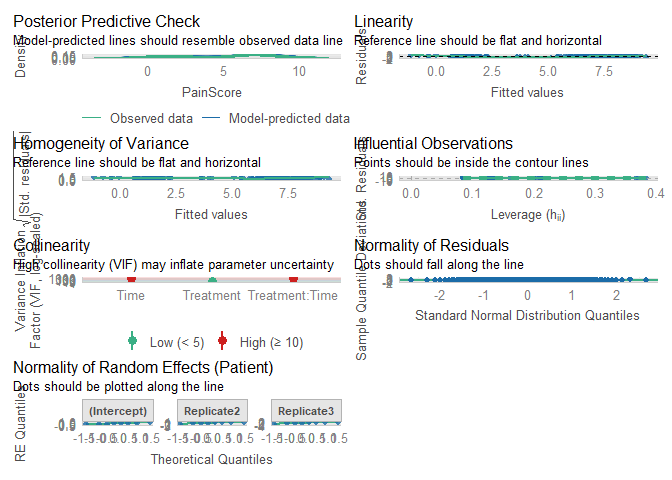
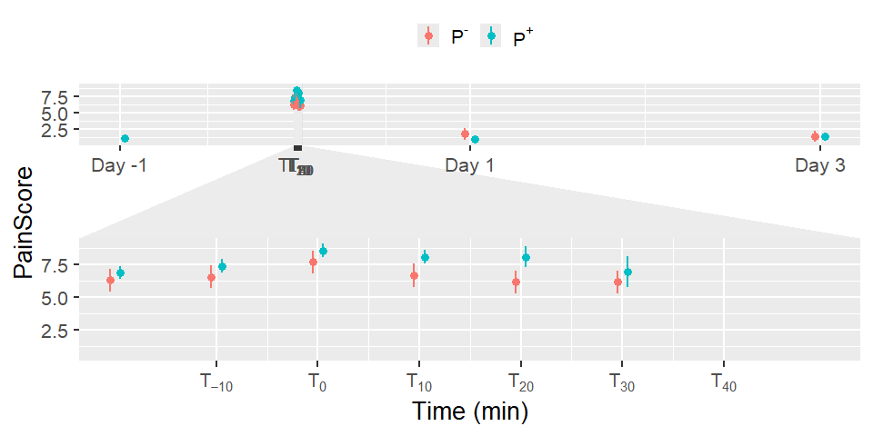
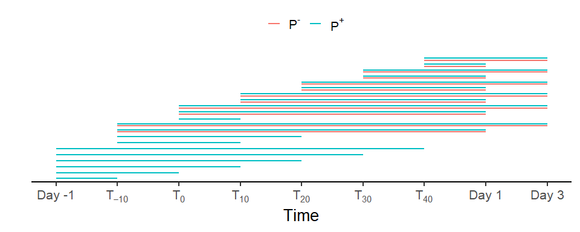
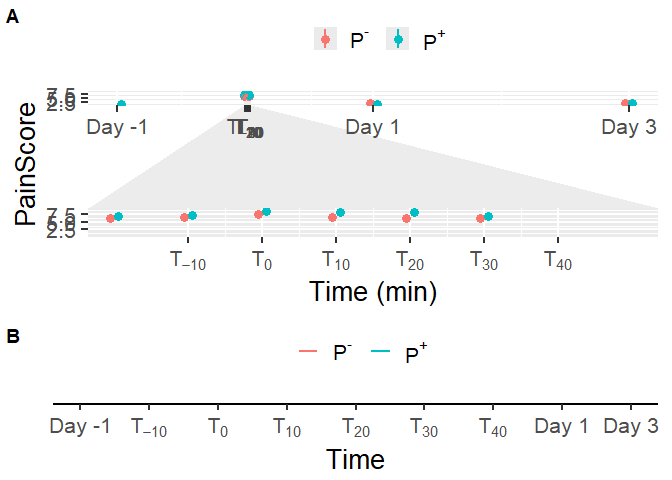

# Read data

``` r
load(file = "DATA/Data.RData") 
Data = Data %>% dplyr::select(Patient,Treatment,Replicate,HousingEnvironment,Time,Manipulation,PainScore) %>% dplyr::mutate(Time = as.factor(Time), Treatment= as.factor(Treatment)) %>% dplyr::mutate ( TempPainScore = as.factor(case_when(
  PainScore <= 4 ~ "NoPain",
  PainScore > 4 ~ "Pain",
  TRUE ~ NA
))) #%>% 
  #dplyr::filter(Time != "-1440")
```

# Model building

``` r
Model = lmer(formula = PainScore ~ Treatment*Time + (1+ Replicate|Patient), data = Data)
```

    ## fixed-effect model matrix is rank deficient so dropping 1 column / coefficient

``` r
summary(Model)
```

    ## Linear mixed model fit by REML. t-tests use Satterthwaite's method [
    ## lmerModLmerTest]
    ## Formula: PainScore ~ Treatment * Time + (1 + Replicate | Patient)
    ##    Data: Data
    ## 
    ## REML criterion at convergence: 555.2
    ## 
    ## Scaled residuals: 
    ##      Min       1Q   Median       3Q      Max 
    ## -2.15340 -0.65229 -0.02102  0.52223  3.00085 
    ## 
    ## Random effects:
    ##  Groups   Name        Variance Std.Dev. Corr       
    ##  Patient  (Intercept) 0.1443   0.3799              
    ##           Replicate2  1.1444   1.0698   -0.98      
    ##           Replicate3  1.9657   1.4020   -0.92  0.90
    ##  Residual             1.0759   1.0373              
    ## Number of obs: 186, groups:  Patient, 8
    ## 
    ## Fixed effects:
    ##                         Estimate Std. Error        df t value Pr(>|t|)    
    ## (Intercept)              1.10019    0.57714  81.99396   1.906  0.06012 .  
    ## TreatmentTRUE            0.01231    0.51833  51.00568   0.024  0.98115    
    ## Time-10                  5.18750    0.63519 148.71568   8.167 1.25e-13 ***
    ## Time0                    5.43750    0.63519 148.71568   8.560 1.30e-14 ***
    ## Time10                   6.56250    0.63519 148.71568  10.332  < 2e-16 ***
    ## Time20                   5.56250    0.63519 148.71568   8.757 4.11e-15 ***
    ## Time30                   5.06250    0.63519 148.71568   7.970 3.84e-13 ***
    ## Time40                   5.06250    0.63519 148.71568   7.970 3.84e-13 ***
    ## Time1440                 0.68750    0.63519 148.71568   1.082  0.28085    
    ## Time4320                 0.31250    0.36673 148.71568   0.852  0.39551    
    ## TreatmentTRUE:Time-10    0.56250    0.63519 148.71568   0.886  0.37728    
    ## TreatmentTRUE:Time0      0.81250    0.63519 148.71568   1.279  0.20284    
    ## TreatmentTRUE:Time10     0.87500    0.63519 148.71568   1.378  0.17041    
    ## TreatmentTRUE:Time20     1.37500    0.63519 148.71568   2.165  0.03201 *  
    ## TreatmentTRUE:Time30     1.90297    0.70166 153.08687   2.712  0.00745 ** 
    ## TreatmentTRUE:Time40     0.75392    0.83975 154.68804   0.898  0.37069    
    ## TreatmentTRUE:Time1440  -0.75000    0.63519 148.71568  -1.181  0.23959    
    ## ---
    ## Signif. codes:  0 '***' 0.001 '**' 0.01 '*' 0.05 '.' 0.1 ' ' 1

    ## 
    ## Correlation matrix not shown by default, as p = 17 > 12.
    ## Use print(x, correlation=TRUE)  or
    ##     vcov(x)        if you need it

    ## fit warnings:
    ## fixed-effect model matrix is rank deficient so dropping 1 column / coefficient

``` r
model_performance(Model,verbose=T)
```

    ## # Indices of model performance
    ## 
    ## AIC     |    AICc |     BIC | R2 (cond.) | R2 (marg.) |   ICC |  RMSE | Sigma
    ## -----------------------------------------------------------------------------
    ## 603.242 | 610.696 | 680.660 |      0.890 |      0.875 | 0.118 | 0.956 | 1.037

``` r
check_residuals(Model)
```

    ## OK: Simulated residuals appear as uniformly distributed (p = 0.281).

``` r
check_heteroscedasticity(Model)
```

    ## OK: Error variance appears to be homoscedastic (p = 0.630).

``` r
check_model(Model)
```



``` r
PlotData = get_model_data(Model, type= "emm", terms= c("Time","Treatment")) 
PlotData = as.data.frame(PlotData) %>% dplyr::mutate( 
   groupString = as.character(group),
    x = case_when(
    x == -1440 & groupString == "FALSE" ~ x - 40 ,
    x == -1440 & groupString == "TRUE" ~ x + 40,
    x == 1440 & groupString == "FALSE" ~ x - 40 ,
    x == 1440 & groupString == "TRUE" ~ x + 40,
    x == 4320 & groupString == "FALSE" ~ x - 40 ,
    x == 4320 & groupString == "TRUE" ~ x + 40,
    TRUE ~ x)
)

PainScorePlot = ggplot(data = PlotData,aes(x= x, y=predicted, color = group))+ 
  geom_point(position = position_dodge(2),size = 3) +
  facet_zoom(xlim = c(-10, 60)) +
  geom_linerange(size = 1, aes(ymin = conf.low, ymax = conf.high,colour = group),position = position_dodge(2)) + 
  xlab("Time (min)") + 
  ylab("PainScore") + 
  scale_x_continuous(labels=c("Day -1",expression(T[scriptstyle(-10)]),expression(T[scriptstyle(0)]),expression(T[scriptstyle(10)]),expression(T[scriptstyle(20)]),expression(T[scriptstyle(30)]),expression(T[scriptstyle(40)]),"Day 1","Day 3"), breaks = c(-1440,0,10,20,30,40,50,1440,4320)) + theme(legend.position = "Top",legend.title = element_text("Puncture"))
```

    ## Warning: Using `size` aesthetic for lines was deprecated in ggplot2 3.4.0.
    ## ℹ Please use `linewidth` instead.
    ## This warning is displayed once every 8 hours.
    ## Call `lifecycle::last_lifecycle_warnings()` to see where this warning was
    ## generated.

``` r
PainScorePlot = PainScorePlot+ theme_grey(base_size = 20) + 
  labs(color = "")+
  scale_color_discrete(labels=c(expression("P"^"-"), expression("P"^"+")))+
  theme(legend.position = "top") 
PainScorePlot
```

    ## Warning: Removed 2 rows containing missing values or values outside the scale range
    ## (`geom_point()`).

    ## Warning: Removed 1 row containing missing values or values outside the scale range
    ## (`geom_segment()`).
    ## Removed 1 row containing missing values or values outside the scale range
    ## (`geom_segment()`).



``` r
ggsave(plot = PainScorePlot,
       filename = "PainScorePlot.png",
       path= "FIGURES/",
       width = 10,
       height = 7)
```

    ## Warning: Removed 2 rows containing missing values or values outside the scale range
    ## (`geom_point()`).

    ## Warning: Removed 1 row containing missing values or values outside the scale range
    ## (`geom_segment()`).
    ## Removed 1 row containing missing values or values outside the scale range
    ## (`geom_segment()`).

``` r
emmeans(Model, pairwise ~ Time|Treatment)
```

    ## $emmeans
    ## Treatment = FALSE:
    ##  Time  emmean    SE    df lower.CL upper.CL
    ##  -1440 nonEst    NA    NA       NA       NA
    ##  -10     6.29 0.474  37.9    5.328     7.25
    ##  0       6.54 0.474  37.9    5.578     7.50
    ##  10      7.66 0.474  37.9    6.703     8.62
    ##  20      6.66 0.474  37.9    5.703     7.62
    ##  30      6.16 0.474  37.9    5.203     7.12
    ##  40      6.16 0.474  37.9    5.203     7.12
    ##  1440    1.79 0.474  37.9    0.828     2.75
    ##  4320    1.41 0.474  37.9    0.453     2.37
    ## 
    ## Treatment = TRUE:
    ##  Time  emmean    SE    df lower.CL upper.CL
    ##  -1440   1.11 0.270 120.5    0.578     1.65
    ##  -10     6.86 0.270 120.5    6.328     7.40
    ##  0       7.36 0.270 120.5    6.828     7.90
    ##  10      8.55 0.270 120.5    8.015     9.08
    ##  20      8.05 0.270 120.5    7.515     8.58
    ##  30      8.08 0.413 131.6    7.260     8.90
    ##  40      6.93 0.641 143.0    5.661     8.20
    ##  1440    1.05 0.270 120.5    0.515     1.58
    ##  4320    1.42 0.270 120.5    0.890     1.96
    ## 
    ## Degrees-of-freedom method: kenward-roger 
    ## Confidence level used: 0.95 
    ## 
    ## $contrasts
    ## Treatment = FALSE:
    ##  contrast                estimate    SE  df t.ratio p.value
    ##  (Time-1440) - (Time-10)   nonEst    NA  NA      NA      NA
    ##  (Time-1440) - Time0       nonEst    NA  NA      NA      NA
    ##  (Time-1440) - Time10      nonEst    NA  NA      NA      NA
    ##  (Time-1440) - Time20      nonEst    NA  NA      NA      NA
    ##  (Time-1440) - Time30      nonEst    NA  NA      NA      NA
    ##  (Time-1440) - Time40      nonEst    NA  NA      NA      NA
    ##  (Time-1440) - Time1440    nonEst    NA  NA      NA      NA
    ##  (Time-1440) - Time4320    nonEst    NA  NA      NA      NA
    ##  (Time-10) - Time0        -0.2500 0.519 148  -0.482  0.9997
    ##  (Time-10) - Time10       -1.3750 0.519 148  -2.651  0.1464
    ##  (Time-10) - Time20       -0.3750 0.519 148  -0.723  0.9962
    ##  (Time-10) - Time30        0.1250 0.519 148   0.241  1.0000
    ##  (Time-10) - Time40        0.1250 0.519 148   0.241  1.0000
    ##  (Time-10) - Time1440      4.5000 0.519 148   8.677  <.0001
    ##  (Time-10) - Time4320      4.8750 0.519 148   9.400  <.0001
    ##  Time0 - Time10           -1.1250 0.519 148  -2.169  0.3765
    ##  Time0 - Time20           -0.1250 0.519 148  -0.241  1.0000
    ##  Time0 - Time30            0.3750 0.519 148   0.723  0.9962
    ##  Time0 - Time40            0.3750 0.519 148   0.723  0.9962
    ##  Time0 - Time1440          4.7500 0.519 148   9.159  <.0001
    ##  Time0 - Time4320          5.1250 0.519 148   9.882  <.0001
    ##  Time10 - Time20           1.0000 0.519 148   1.928  0.5340
    ##  Time10 - Time30           1.5000 0.519 148   2.892  0.0815
    ##  Time10 - Time40           1.5000 0.519 148   2.892  0.0815
    ##  Time10 - Time1440         5.8750 0.519 148  11.328  <.0001
    ##  Time10 - Time4320         6.2500 0.519 148  12.051  <.0001
    ##  Time20 - Time30           0.5000 0.519 148   0.964  0.9787
    ##  Time20 - Time40           0.5000 0.519 148   0.964  0.9787
    ##  Time20 - Time1440         4.8750 0.519 148   9.400  <.0001
    ##  Time20 - Time4320         5.2500 0.519 148  10.123  <.0001
    ##  Time30 - Time40           0.0000 0.519 148   0.000  1.0000
    ##  Time30 - Time1440         4.3750 0.519 148   8.436  <.0001
    ##  Time30 - Time4320         4.7500 0.519 148   9.159  <.0001
    ##  Time40 - Time1440         4.3750 0.519 148   8.436  <.0001
    ##  Time40 - Time4320         4.7500 0.519 148   9.159  <.0001
    ##  Time1440 - Time4320       0.3750 0.519 148   0.723  0.9962
    ## 
    ## Treatment = TRUE:
    ##  contrast                estimate    SE  df t.ratio p.value
    ##  (Time-1440) - (Time-10)  -5.7500 0.367 148 -15.679  <.0001
    ##  (Time-1440) - Time0      -6.2500 0.367 148 -17.043  <.0001
    ##  (Time-1440) - Time10     -7.4375 0.367 148 -20.281  <.0001
    ##  (Time-1440) - Time20     -6.9375 0.367 148 -18.917  <.0001
    ##  (Time-1440) - Time30     -6.9655 0.485 156 -14.370  <.0001
    ##  (Time-1440) - Time40     -5.8164 0.688 155  -8.459  <.0001
    ##  (Time-1440) - Time1440    0.0625 0.367 148   0.170  1.0000
    ##  (Time-1440) - Time4320   -0.3125 0.367 148  -0.852  0.9949
    ##  (Time-10) - Time0        -0.5000 0.367 148  -1.363  0.9096
    ##  (Time-10) - Time10       -1.6875 0.367 148  -4.602  0.0003
    ##  (Time-10) - Time20       -1.1875 0.367 148  -3.238  0.0386
    ##  (Time-10) - Time30       -1.2155 0.485 156  -2.508  0.2365
    ##  (Time-10) - Time40       -0.0664 0.688 155  -0.097  1.0000
    ##  (Time-10) - Time1440      5.8125 0.367 148  15.850  <.0001
    ##  (Time-10) - Time4320      5.4375 0.367 148  14.827  <.0001
    ##  Time0 - Time10           -1.1875 0.367 148  -3.238  0.0386
    ##  Time0 - Time20           -0.6875 0.367 148  -1.875  0.6321
    ##  Time0 - Time30           -0.7155 0.485 156  -1.476  0.8650
    ##  Time0 - Time40            0.4336 0.688 155   0.631  0.9994
    ##  Time0 - Time1440          6.3125 0.367 148  17.213  <.0001
    ##  Time0 - Time4320          5.9375 0.367 148  16.191  <.0001
    ##  Time10 - Time20           0.5000 0.367 148   1.363  0.9096
    ##  Time10 - Time30           0.4720 0.485 156   0.974  0.9877
    ##  Time10 - Time40           1.6211 0.688 155   2.357  0.3151
    ##  Time10 - Time1440         7.5000 0.367 148  20.451  <.0001
    ##  Time10 - Time4320         7.1250 0.367 148  19.429  <.0001
    ##  Time20 - Time30          -0.0280 0.485 156  -0.058  1.0000
    ##  Time20 - Time40           1.1211 0.688 155   1.630  0.7867
    ##  Time20 - Time1440         7.0000 0.367 148  19.088  <.0001
    ##  Time20 - Time4320         6.6250 0.367 148  18.065  <.0001
    ##  Time30 - Time40           1.1491 0.738 155   1.557  0.8260
    ##  Time30 - Time1440         7.0280 0.485 156  14.499  <.0001
    ##  Time30 - Time4320         6.6530 0.485 156  13.726  <.0001
    ##  Time40 - Time1440         5.8789 0.688 155   8.549  <.0001
    ##  Time40 - Time4320         5.5039 0.688 155   8.004  <.0001
    ##  Time1440 - Time4320      -0.3750 0.367 148  -1.023  0.9831
    ## 
    ## Degrees-of-freedom method: kenward-roger 
    ## P value adjustment: tukey method for varying family sizes

``` r
dfplot = emmeans(Model,pairwise ~Time|Treatment)
```

``` r
dfplot = dfplot$contrasts %>% as.data.frame() %>% 
  dplyr::filter(p.value <= 0.05) %>% 
  dplyr::mutate(contrast1 = contrast) %>%
  tidyr::separate(contrast1,c("first","second"), sep = " - ") %>%
  dplyr::mutate(firstnumeric = case_when(
    first =="(Time-1440)" ~ 1,
    first =="(Time-10)" ~ 2,
    first =="Time0" ~ 3,
    first =="Time10" ~ 4,
    first =="Time20" ~ 5,
    first =="Time30" ~ 6,
    first =="Time40" ~ 7,
    first =="Time1440" ~ 8,
    first =="Time4320" ~ 9,
    TRUE ~ 0
  ),
  secondnumeric = case_when(
    second =="(Time-1440)" ~ 1,
    second =="(Time-10)" ~ 2,
    second =="Time0" ~ 3,
    second =="Time10" ~ 4,
    second =="Time20" ~ 5,
    second =="Time30" ~ 6,
    second =="Time40" ~ 7,
    second =="Time1440" ~ 8,
    second =="Time4320" ~ 9,
    TRUE ~ 0
  ),
  )
```

``` r
Time = ggplot(data = dfplot, aes(y = contrast,colour= Treatment)) +
  scale_x_continuous(breaks = c(1,2,3,4,5,6,7,8,9),labels=c("(Time-1440)"="Day -1","(Time-10)"=expression(T[scriptstyle(-10)]),"Time0"=expression(T[scriptstyle(0)]),"Time10"=expression(T[scriptstyle(10)]),"Time20"=expression(T[scriptstyle(20)]),"Time30"=expression(T[scriptstyle(30)]),"Time40"=expression(T[scriptstyle(40)]),"Time1440"="Day 1","Time4320"="Day 3")) + 
  geom_errorbarh(aes(xmax = firstnumeric, xmin = secondnumeric,height = 0), 
                 position = position_dodge(.75),
                 size = 1) + 
  labs(y = "",x= "Time") +
  theme_classic(base_size = 20) + 
  theme(
    axis.line.y = element_blank(),
    axis.text.y = element_blank(),
    axis.ticks.y= element_blank(), 
    text = element_text(colour = "black")
  ) +  
  labs(color = "")+
  scale_color_discrete(labels=c(expression("P"^"-"), expression("P"^"+")))+
  theme(legend.position = "top")
Time
```



``` r
Together  = ggarrange(PainScorePlot, Time,ncol=1,nrow = 2,labels = "AUTO",heights = c(2,1))
```

    ## Warning: Removed 2 rows containing missing values or values outside the scale range
    ## (`geom_point()`).

    ## Warning: Removed 1 row containing missing values or values outside the scale range
    ## (`geom_segment()`).
    ## Removed 1 row containing missing values or values outside the scale range
    ## (`geom_segment()`).

``` r
Together
```



``` r
ggsave(plot = Together,
       filename = "PainScorePlotTogether.png",
       path= "FIGURES/",
       width = 10,
       height = 12
       )
```
