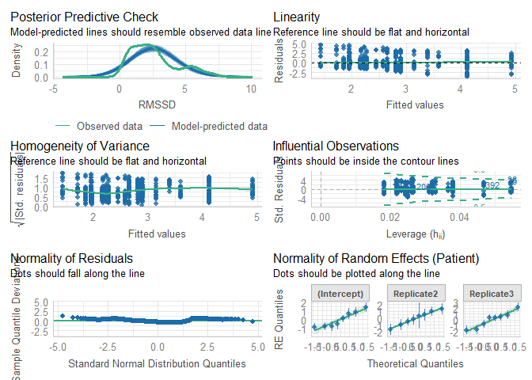

# Read data

``` r
load(file = "DATA/Cardiovascular.RData") 
cardiovascular = cardiovascular %>% 
    dplyr::select(Patient,Replicate,Time,Sedation,IntravaginalDevice,RectalManipulation,Puncturing,Needle,RMSSD) %>% 
    dplyr::mutate(Time = as.factor(Time), 
                  Needle = as.factor(Needle),
                  RMSSD = log(RMSSD)) %>%
    filter(IntravaginalDevice == TRUE)
```

# Model building

``` r
Model = lmer(RMSSD ~ Needle + (1+Replicate|Patient), data = cardiovascular)
```

``` r
summary(Model)
```

    ## Linear mixed model fit by REML. t-tests use Satterthwaite's method [
    ## lmerModLmerTest]
    ## Formula: RMSSD ~ Needle + (1 + Replicate | Patient)
    ##    Data: cardiovascular
    ## 
    ## REML criterion at convergence: 2748.4
    ## 
    ## Scaled residuals: 
    ##     Min      1Q  Median      3Q     Max 
    ## -2.3955 -0.6568 -0.2077  0.4146  3.0701 
    ## 
    ## Random effects:
    ##  Groups   Name        Variance Std.Dev. Corr       
    ##  Patient  (Intercept) 0.8327   0.9125              
    ##           Replicate2  1.1382   1.0668   -0.40      
    ##           Replicate3  1.8788   1.3707   -0.81  0.39
    ##  Residual             2.2718   1.5073              
    ## Number of obs: 736, groups:  Patient, 8
    ## 
    ## Fixed effects:
    ##             Estimate Std. Error     df t value Pr(>|t|)    
    ## (Intercept)   2.5052     0.3008 6.9861   8.327 7.13e-05 ***
    ## NeedleTRUE    0.2091     0.4649 7.1404   0.450    0.666    
    ## ---
    ## Signif. codes:  0 '***' 0.001 '**' 0.01 '*' 0.05 '.' 0.1 ' ' 1
    ## 
    ## Correlation of Fixed Effects:
    ##            (Intr)
    ## NeedleTRUE -0.757

``` r
check_model(Model)
```



``` r
model_performance(Model,verbose=T)
```

    ## # Indices of model performance
    ## 
    ## AIC      |     AICc |      BIC | R2 (cond.) | R2 (marg.) |   ICC |  RMSE | Sigma
    ## --------------------------------------------------------------------------------
    ## 2766.433 | 2766.681 | 2807.844 |      0.271 |      0.003 | 0.268 | 1.486 | 1.507

``` r
check_residuals(Model)
```

    ## Warning: Non-uniformity of simulated residuals detected (p < .001).

``` r
check_homogeneity(Model)
```

    ## OK: There is not clear evidence for different variances across groups (Bartlett Test, p = 0.837).
