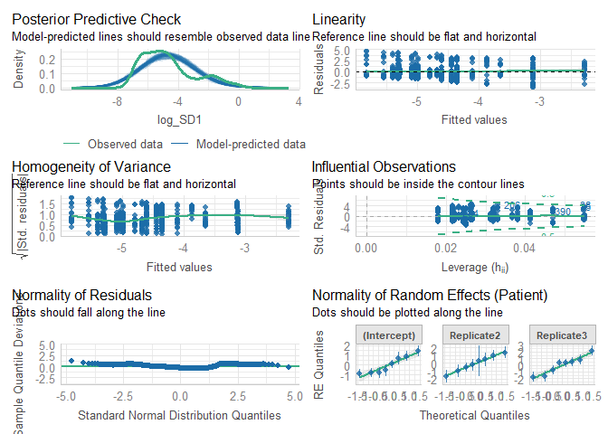

# Read data

``` r
load(file = "DATA/Cardiovascular.RData") 
cardiovascular = cardiovascular %>% 
    dplyr::select(Patient,Replicate,Time,Sedation,IntravaginalDevice,RectalManipulation,Puncturing,Needle,log_SD1,SD1) %>% 
    dplyr::mutate(Time = as.factor(Time), 
                  Needle = as.factor(Needle),
                  log_SD1 = log_SD1) %>%
    filter(IntravaginalDevice == TRUE,
           SD1 != 0)
```

# Model building

``` r
Model = lmer(log_SD1 ~ Needle + (1 + Replicate|Patient), data = cardiovascular)
```

``` r
summary(Model)
```

    ## Linear mixed model fit by REML. t-tests use Satterthwaite's method [
    ## lmerModLmerTest]
    ## Formula: log_SD1 ~ Needle + (1 + Replicate | Patient)
    ##    Data: cardiovascular
    ## 
    ## REML criterion at convergence: 2738.8
    ## 
    ## Scaled residuals: 
    ##     Min      1Q  Median      3Q     Max 
    ## -2.4113 -0.6536 -0.2055  0.4168  3.0880 
    ## 
    ## Random effects:
    ##  Groups   Name        Variance Std.Dev. Corr       
    ##  Patient  (Intercept) 0.8358   0.9142              
    ##           Replicate2  1.1551   1.0748   -0.39      
    ##           Replicate3  1.8869   1.3736   -0.81  0.38
    ##  Residual             2.2639   1.5046              
    ## Number of obs: 734, groups:  Patient, 8
    ## 
    ## Fixed effects:
    ##             Estimate Std. Error      df t value Pr(>|t|)    
    ## (Intercept)  -4.7427     0.3016  6.9869  -15.73 1.04e-06 ***
    ## NeedleTRUE    0.2103     0.4669  7.1338    0.45    0.666    
    ## ---
    ## Signif. codes:  0 '***' 0.001 '**' 0.01 '*' 0.05 '.' 0.1 ' ' 1
    ## 
    ## Correlation of Fixed Effects:
    ##            (Intr)
    ## NeedleTRUE -0.756

``` r
check_model(Model)
```


