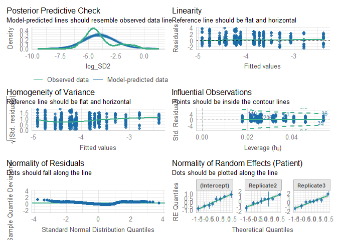

# Read data

``` r
load(file = "DATA/Cardiovascular.RData") 
cardiovascular = cardiovascular %>% 
    dplyr::select(Patient,Replicate,Time,Sedation,IntravaginalDevice,RectalManipulation,Puncturing,Needle,log_SD2,SD2) %>% 
    dplyr::mutate(Time = as.factor(Time), 
                  Needle = as.factor(Needle),
                  log_SD2 = log_SD2) %>%
    filter(IntravaginalDevice == TRUE,
           SD2 != 0.0)
```

# Model building

``` r
Model = lmer(log_SD2 ~ Needle + (1 + Replicate|Patient), data = cardiovascular)
```

``` r
summary(Model)
```

    ## Linear mixed model fit by REML. t-tests use Satterthwaite's method [
    ## lmerModLmerTest]
    ## Formula: log_SD2 ~ Needle + (1 + Replicate | Patient)
    ##    Data: cardiovascular
    ## 
    ## REML criterion at convergence: 2395.6
    ## 
    ## Scaled residuals: 
    ##     Min      1Q  Median      3Q     Max 
    ## -2.1885 -0.6541 -0.2360  0.4199  3.1721 
    ## 
    ## Random effects:
    ##  Groups   Name        Variance Std.Dev. Corr       
    ##  Patient  (Intercept) 0.4076   0.6384              
    ##           Replicate2  0.7276   0.8530   -0.46      
    ##           Replicate3  0.9818   0.9909   -0.75  0.46
    ##  Residual             1.4204   1.1918              
    ## Number of obs: 734, groups:  Patient, 8
    ## 
    ## Fixed effects:
    ##             Estimate Std. Error      df t value Pr(>|t|)    
    ## (Intercept)  -4.0540     0.2373  6.9579 -17.082 6.15e-07 ***
    ## NeedleTRUE    0.1215     0.3278  7.1676   0.371    0.722    
    ## ---
    ## Signif. codes:  0 '***' 0.001 '**' 0.01 '*' 0.05 '.' 0.1 ' ' 1
    ## 
    ## Correlation of Fixed Effects:
    ##            (Intr)
    ## NeedleTRUE -0.762

``` r
check_model(Model)
```


