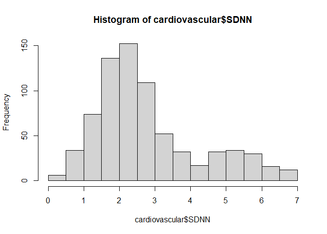
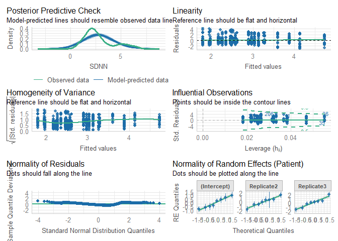

# Read data

``` r
load(file = "DATA/Cardiovascular.RData") 
cardiovascular = cardiovascular %>% 
    dplyr::select(Patient,Replicate,Time,Sedation,IntravaginalDevice,RectalManipulation,Puncturing,Needle,SDNN) %>% 
    dplyr::mutate(Time = as.factor(Time), 
                  Needle = as.factor(Needle),
                  SDNN = log(SDNN)
                  ) %>%
    filter(IntravaginalDevice == TRUE)
hist(cardiovascular$SDNN)
```



# Model building

``` r
Model = lmer(SDNN ~ Needle + (1+Replicate|Patient), data = cardiovascular)
```

``` r
summary(Model)
```

    ## Linear mixed model fit by REML. t-tests use Satterthwaite's method [
    ## lmerModLmerTest]
    ## Formula: SDNN ~ Needle + (1 + Replicate | Patient)
    ##    Data: cardiovascular
    ## 
    ## REML criterion at convergence: 2499.3
    ## 
    ## Scaled residuals: 
    ##     Min      1Q  Median      3Q     Max 
    ## -2.3033 -0.6307 -0.2335  0.3772  3.2861 
    ## 
    ## Random effects:
    ##  Groups   Name        Variance Std.Dev. Corr       
    ##  Patient  (Intercept) 0.5318   0.7292              
    ##           Replicate2  0.9525   0.9760   -0.45      
    ##           Replicate3  1.2556   1.1205   -0.77  0.43
    ##  Residual             1.6166   1.2714              
    ## Number of obs: 736, groups:  Patient, 8
    ## 
    ## Fixed effects:
    ##             Estimate Std. Error     df t value Pr(>|t|)    
    ## (Intercept)   2.6928     0.2622 6.9759  10.270 1.84e-05 ***
    ## NeedleTRUE    0.1632     0.3750 7.1481   0.435    0.676    
    ## ---
    ## Signif. codes:  0 '***' 0.001 '**' 0.01 '*' 0.05 '.' 0.1 ' ' 1
    ## 
    ## Correlation of Fixed Effects:
    ##            (Intr)
    ## NeedleTRUE -0.765

``` r
check_model(Model)
```



``` r
model_performance(Model,verbose=T)
```

    ## # Indices of model performance
    ## 
    ## AIC      |     AICc |      BIC | R2 (cond.) | R2 (marg.) |   ICC |  RMSE | Sigma
    ## --------------------------------------------------------------------------------
    ## 2517.288 | 2517.536 | 2558.699 |      0.250 |      0.003 | 0.248 | 1.253 | 1.271

``` r
check_residuals(Model)
```

    ## Warning: Non-uniformity of simulated residuals detected (p < .001).

``` r
check_homogeneity(Model)
```

    ## OK: There is not clear evidence for different variances across groups (Bartlett Test, p = 0.756).
