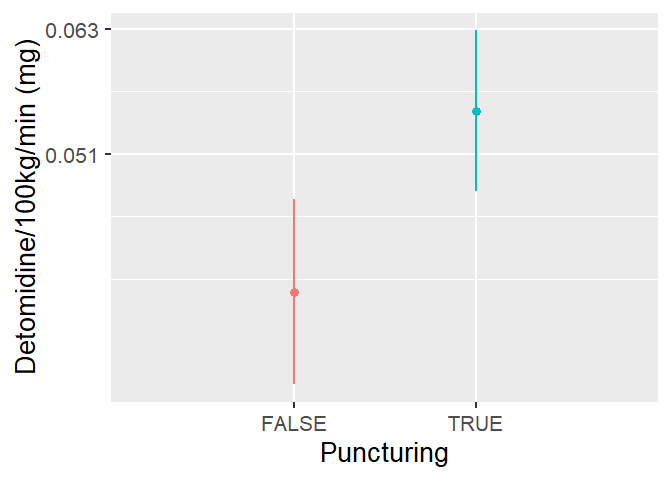

# Read data

``` r
load(file = "DATA/Sedation.RData") 
sedation = sedation %>% 
  dplyr::select(Patient,Treatment,Replicate,Detomidine) %>%   
  dplyr::mutate(Treatment= as.factor(Treatment),
                Detomidine = sqrt(Detomidine))
```

# Model building

``` r
Model = lmer(Detomidine ~ Treatment + (1|Patient), data = sedation)
```

``` r
summary(Model)
```

    ## Linear mixed model fit by REML. t-tests use Satterthwaite's method [
    ## lmerModLmerTest]
    ## Formula: Detomidine ~ Treatment + (1 | Patient)
    ##    Data: sedation
    ## 
    ## REML criterion at convergence: -98
    ## 
    ## Scaled residuals: 
    ##      Min       1Q   Median       3Q      Max 
    ## -1.70017 -0.63324 -0.00971  0.59564  2.19256 
    ## 
    ## Random effects:
    ##  Groups   Name        Variance  Std.Dev.
    ##  Patient  (Intercept) 0.0002127 0.01459 
    ##  Residual             0.0004035 0.02009 
    ## Number of obs: 24, groups:  Patient, 8
    ## 
    ## Fixed effects:
    ##                Estimate Std. Error        df t value Pr(>|t|)    
    ## (Intercept)    0.197446   0.008777 17.222924  22.497 3.28e-14 ***
    ## TreatmentTRUE  0.036156   0.008698 15.000000   4.157 0.000843 ***
    ## ---
    ## Signif. codes:  0 '***' 0.001 '**' 0.01 '*' 0.05 '.' 0.1 ' ' 1
    ## 
    ## Correlation of Fixed Effects:
    ##             (Intr)
    ## TretmntTRUE -0.661

``` r
model_performance(Model,verbose=T)
```

    ## # Indices of model performance
    ## 
    ## AIC     |    AICc |     BIC | R2 (cond.) | R2 (marg.) |   ICC |  RMSE | Sigma
    ## -----------------------------------------------------------------------------
    ## -90.014 | -87.908 | -85.301 |      0.561 |      0.330 | 0.345 | 0.017 | 0.020

``` r
check_residuals(Model)
```

    ## OK: Simulated residuals appear as uniformly distributed (p = 0.523).

``` r
check_homogeneity(Model)
```

    ## OK: There is not clear evidence for different variances across groups (Bartlett Test, p = 0.057).

``` r
PlotData = as.data.frame(ls_means(Model))
PlotData
```

    ##                     term levels  Estimate  Std. Error        df  t value
    ## TreatmentFALSE Treatment  FALSE 0.1974461 0.008776536 17.222924 22.49704
    ## TreatmentTRUE  Treatment   TRUE 0.2336024 0.007197895  9.802345 32.45427
    ##                    lower     upper     Pr(>|t|)
    ## TreatmentFALSE 0.1789475 0.2159447 3.281484e-14
    ## TreatmentTRUE  0.2175206 0.2496843 2.641441e-11

``` r
SedationPlot = ggplot(data = PlotData,aes(x= levels, y=Estimate, color = levels))+
  geom_point(position = position_dodge(2),size = 3) +
  geom_linerange(size = 1, aes(ymin = lower, ymax = upper,colour = levels)) + 
  xlab("Puncturing") + 
  ylab("Detomidine/100kg/min (mg)") + 
  scale_y_continuous(labels=c("0.051","0.063","0.076"), breaks = c(0.225,0.250,0.275)) +
  theme(legend.position = "none")
```

    ## Warning: Using `size` aesthetic for lines was deprecated in ggplot2 3.4.0.
    ## ℹ Please use `linewidth` instead.
    ## This warning is displayed once every 8 hours.
    ## Call `lifecycle::last_lifecycle_warnings()` to see where this warning was
    ## generated.

``` r
SedationPlot = SedationPlot+ theme_grey(base_size = 20) + 
  labs(color = "")+
  scale_color_discrete(labels=c(expression("P"^"-"), expression("P"^"+")))+
  theme(legend.position = "none") 
SedationPlot
```

    ## Warning: `position_dodge()` requires non-overlapping x intervals.



``` r
ggsave(plot = SedationPlot,
       filename = "SedationPlot.png",
       path= "FIGURES/",
       width = 10,
       height = 7)
```

    ## Warning: `position_dodge()` requires non-overlapping x intervals.
