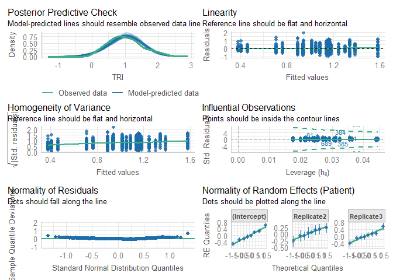

# Read data

``` r
load(file = "DATA/Cardiovascular.RData") 
cardiovascular = cardiovascular %>% 
    dplyr::select(Patient,Replicate,Time,Sedation,IntravaginalDevice,RectalManipulation,Puncturing,Needle,TRI) %>% 
    dplyr::mutate(Time = as.factor(Time), 
                  Needle = as.factor(Needle),
                  TRI = log(TRI)) %>%
    filter(IntravaginalDevice == TRUE)
```

# Model building

``` r
Model = lmer(TRI ~ Needle + (1 + Replicate|Patient), data = cardiovascular)
```

``` r
summary(Model)
```

    ## Linear mixed model fit by REML. t-tests use Satterthwaite's method [
    ## lmerModLmerTest]
    ## Formula: TRI ~ Needle + (1 + Replicate | Patient)
    ##    Data: cardiovascular
    ## 
    ## REML criterion at convergence: 889.7
    ## 
    ## Scaled residuals: 
    ##     Min      1Q  Median      3Q     Max 
    ## -2.3924 -0.6746 -0.0910  0.5469  4.5744 
    ## 
    ## Random effects:
    ##  Groups   Name        Variance Std.Dev. Corr       
    ##  Patient  (Intercept) 0.12713  0.3565              
    ##           Replicate2  0.03624  0.1904   -0.38      
    ##           Replicate3  0.08578  0.2929   -0.62  0.62
    ##  Residual             0.18103  0.4255              
    ## Number of obs: 736, groups:  Patient, 8
    ## 
    ## Fixed effects:
    ##             Estimate Std. Error       df t value Pr(>|t|)    
    ## (Intercept)  1.01662    0.10393  6.94677   9.782  2.6e-05 ***
    ## NeedleTRUE  -0.02639    0.09095  7.20707  -0.290     0.78    
    ## ---
    ## Signif. codes:  0 '***' 0.001 '**' 0.01 '*' 0.05 '.' 0.1 ' ' 1
    ## 
    ## Correlation of Fixed Effects:
    ##            (Intr)
    ## NeedleTRUE -0.254

``` r
check_model(Model)
```



``` r
model_performance(Model,verbose=T)
```

    ## # Indices of model performance
    ## 
    ## AIC     |    AICc |     BIC | R2 (cond.) | R2 (marg.) |   ICC |  RMSE | Sigma
    ## -----------------------------------------------------------------------------
    ## 907.739 | 907.987 | 949.150 |      0.413 |  5.505e-04 | 0.413 | 0.420 | 0.425

``` r
check_residuals(Model)
```

    ## OK: Simulated residuals appear as uniformly distributed (p = 0.411).

``` r
check_homogeneity(Model)
```

    ## OK: There is not clear evidence for different variances across groups (Bartlett Test, p = 0.127).
