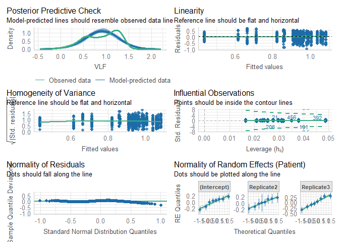

# Read data

``` r
load(file = "DATA/Cardiovascular.RData") 
cardiovascular = cardiovascular %>% 
    dplyr::select(Patient,Replicate,Time,Sedation,IntravaginalDevice,RectalManipulation,Puncturing,Needle,VLF) %>% 
    dplyr::mutate(Time = as.factor(Time), 
                  Needle = as.factor(Needle),
                  VLF = sqrt(VLF)) %>%
    filter(IntravaginalDevice == TRUE)
```

# Model building

``` r
Model = lmer(VLF ~ Needle + (1 + Replicate|Patient), data = cardiovascular)
```

``` r
summary(Model)
```

    ## Linear mixed model fit by REML. t-tests use Satterthwaite's method [
    ## lmerModLmerTest]
    ## Formula: VLF ~ Needle + (1 + Replicate | Patient)
    ##    Data: cardiovascular
    ## 
    ## REML criterion at convergence: 460.9
    ## 
    ## Scaled residuals: 
    ##     Min      1Q  Median      3Q     Max 
    ## -3.0733 -0.7647  0.1290  0.8015  2.0722 
    ## 
    ## Random effects:
    ##  Groups   Name        Variance Std.Dev. Corr       
    ##  Patient  (Intercept) 0.02279  0.1510              
    ##           Replicate2  0.01943  0.1394   -0.04      
    ##           Replicate3  0.05806  0.2410   -0.82  0.03
    ##  Residual             0.10204  0.3194              
    ## Number of obs: 736, groups:  Patient, 8
    ## 
    ## Fixed effects:
    ##             Estimate Std. Error       df t value Pr(>|t|)    
    ## (Intercept)  0.93841    0.05467  6.92391  17.164 6.25e-07 ***
    ## NeedleTRUE  -0.06382    0.08920  6.91023  -0.716    0.498    
    ## ---
    ## Signif. codes:  0 '***' 0.001 '**' 0.01 '*' 0.05 '.' 0.1 ' ' 1
    ## 
    ## Correlation of Fixed Effects:
    ##            (Intr)
    ## NeedleTRUE -0.792

``` r
model_performance(Model,verbose=T)
```

    ## # Indices of model performance
    ## 
    ## AIC     |    AICc |     BIC | R2 (cond.) | R2 (marg.) |   ICC |  RMSE | Sigma
    ## -----------------------------------------------------------------------------
    ## 478.945 | 479.193 | 520.356 |      0.189 |      0.008 | 0.183 | 0.315 | 0.319

``` r
check_model(Model)
```


