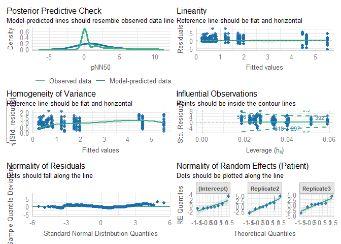

# Read data

``` r
load(file = "DATA/Cardiovascular.RData") 
cardiovascular = cardiovascular %>% 
    dplyr::select(Patient,Replicate,Time,Sedation,IntravaginalDevice,RectalManipulation,Puncturing,Needle,pNN50) %>% 
    dplyr::mutate(Time = as.factor(Time), 
                  Needle = as.factor(Needle),
                  pNN50 = sqrt(pNN50)) %>%
    dplyr::filter(IntravaginalDevice == TRUE
                  )
```

# Model building

``` r
Model = lmer(pNN50 ~ Needle + (1+Replicate|Patient), data = cardiovascular)
```

``` r
summary(Model)
```

    ## Linear mixed model fit by REML. t-tests use Satterthwaite's method [
    ## lmerModLmerTest]
    ## Formula: pNN50 ~ Needle + (1 + Replicate | Patient)
    ##    Data: cardiovascular
    ## 
    ## REML criterion at convergence: 2969.3
    ## 
    ## Scaled residuals: 
    ##     Min      1Q  Median      3Q     Max 
    ## -3.1688 -0.4505 -0.2113  0.3993  4.4604 
    ## 
    ## Random effects:
    ##  Groups   Name        Variance Std.Dev. Corr       
    ##  Patient  (Intercept) 2.056    1.434               
    ##           Replicate2  5.446    2.334    -0.63      
    ##           Replicate3  5.200    2.280    -0.79  0.37
    ##  Residual             3.006    1.734               
    ## Number of obs: 736, groups:  Patient, 8
    ## 
    ## Fixed effects:
    ##             Estimate Std. Error     df t value Pr(>|t|)  
    ## (Intercept)   1.1607     0.5181 6.9829   2.240   0.0601 .
    ## NeedleTRUE    0.2320     0.7645 7.0908   0.303   0.7702  
    ## ---
    ## Signif. codes:  0 '***' 0.001 '**' 0.01 '*' 0.05 '.' 0.1 ' ' 1
    ## 
    ## Correlation of Fixed Effects:
    ##            (Intr)
    ## NeedleTRUE -0.863

``` r
check_model(Model)
```



``` r
model_performance(Model,verbose=T)
```

    ## # Indices of model performance
    ## 
    ## AIC      |     AICc |      BIC | R2 (cond.) | R2 (marg.) |   ICC |  RMSE | Sigma
    ## --------------------------------------------------------------------------------
    ## 2987.316 | 2987.564 | 3028.727 |      0.408 |      0.003 | 0.406 | 1.708 | 1.734

``` r
check_residuals(Model)
```

    ## Warning: Non-uniformity of simulated residuals detected (p < .001).

``` r
check_homogeneity(Model)
```

    ## Warning: Variances differ between groups (Bartlett Test, p = 0.017).
